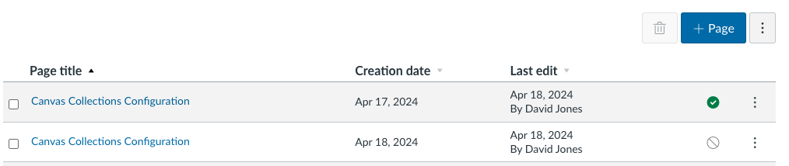
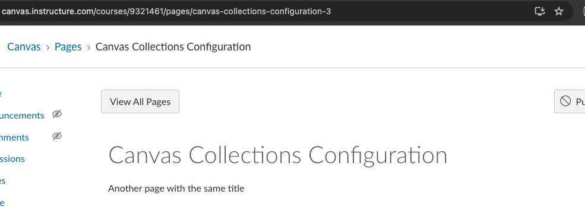
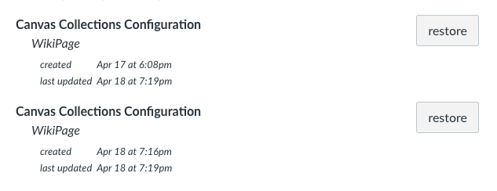

<!--
 Copyright (C) 2023 David Jones
 
 This file is part of Canvas Collections.
 
 Canvas Collections is free software: you can redistribute it and/or modify
 it under the terms of the GNU General Public License as published by
 the Free Software Foundation, either version 3 of the License, or
 (at your option) any later version.
 
 Canvas Collections is distributed in the hope that it will be useful,
 but WITHOUT ANY WARRANTY; without even the implied warranty of
 MERCHANTABILITY or FITNESS FOR A PARTICULAR PURPOSE.  See the
 GNU General Public License for more details.
 
 You should have received a copy of the GNU General Public License
 along with Canvas Collections.  If not, see <http://www.gnu.org/licenses/>.
-->

# Limitations

!!! Abstract "The main limitations of Canvas Collections"

    1. Collections is not usable on the Canvas mobile apps (teacher or student). [see more](#canvas-mobile-apps---essentially-not-usable)
    2. The Collections source code must be installed and active when visitors are using a web browser in order to configure Collections and navigate using "live" Collections [see more](#collections-installed-and-active---live-collections)
    3. Claytons (static) Collections can be used to navigate without the Collections source code (but has to be configured with the code), but some representations will require additional CSS. [see more](#claytons-collections---no-code-but-some-css-may-be-required)

## Cannot be used via Canvas mobile apps, only via web browsers

Canvas Collections is custom JavaScript/CSS that modifies the Canvas modules _web_ page and helps with navigation to Canvas modules (on the Canvas modules _web_ page). The Canvas mobile apps do not use Canvas _web_ pages and do [not (at least easily) support custom JavaScript/CSS](https://community.canvaslms.com/t5/Canvas-Mobile-Forum/iOS-app-and-Canvas/m-p/465811/highlight/true#M350). 

## Collections must be installed and active (for live Collections)

Collection provides [configuration](../configure/overview.md) (teaching staff) and [navigation](../navigate/navigate-options.md) (all users) functionality.

To configure Canvas Collections you must be using a Web browser with the Collections JavaScript [installed and active](../getting-started/install/is-it-installed.md). 

Collections provides [two navigation experiences](../navigate/navigate-options.md): live Collections and Claytons Collections. Live Collections requires the Collections JavaScript to be installed and active. 

## Claytons Collections - no code, but some CSS may be required

Navigating with Claytons Collections is essentially viewing a Canvas page with static HTML and CSS. No JavaScript is required. However, Canvas [limits what HTML and CSS](https://community.canvaslms.com/t5/Canvas-Resource-Documents/Canvas-HTML-Editor-Allowlist/ta-p/387066) can be used on Canvas pages.

Some [representations](../reference/conceptual-model/representations/overview.md) fit within those limits (e.g. the [_HorizontalCards_ representation](../reference/conceptual-model/representations/horizontal-cards.md)), but others do not (e.g. the [_GriffithCards_ representation](../reference/conceptual-model/representations/griffith-cards.md)). The latter will not display correctly without this HTML/CSS.

Adding the required HTML/CSS is difficult if not impossible for mobile app users ([see above](#canvas-mobile-apps---essentially-not-usable)). For web browsers, the relevant HTML/CSS can be installed either by the Canvas administrator, or by the teacher/designer where a tool like CIDI Labs Design Plus is available.

## Problems if you delete and re-create the Collections configuration page

Canvas Collections stores all its configuration information in a single Canvas page in the host course. That page must be called "Canvas Collections Configuration" and have the url _https://<your_canvas_instance>/courses/<course_id>/pages/canvas-collections-configuration_. If Collections cannot access this page, it will not work.

In September, 2013 Instructure introduced changes to [how page titles and URLs operate](https://community.canvaslms.com/t5/Canvas-Releases/Canvas-Release-Notes-2023-09-16/ta-p/577167#toc-hId-1051913398). Changes which mean the page title [may not match the page URL](https://community.canvaslms.com/t5/Canvas-Question-Forum/Page-URL-doesn-t-match-page-title/m-p/590189). For example, you may see a page titled "Canvas Collections Configuration" in your course, but if you examine the URL it will look something like _https://<your_canvas_instance>/courses/<course_id>/pages/canvas-collections-configuration**-5**_.

!!! note "Canvas adds numbers to URLs to distinguish repeated page titles""

    The URL above ended in **-5**. Representing Canvas' practice of adding a number to a URL when multiple pages have the same name.

<figure markdown>
<figcaption>Two pages with the same name. The most recent page's URL ends with <strong>canvas-collections-configuration-2</strong> as the second page created with that title.</figcaption>

</figure>

!!! note "Deleting results in **-5** outcomes"

    Due to the changes in 2013, if you delete a Canvas page any subsequent page created with the same page title will have a URL ending in a number.

<figure markdown>
<figcaption>Deleting the first two pages named "Canvas Collections Configuration" and creating a new page with the same title results in the URL ending in <strong>-3</strong></figcaption>

</figure>

!!! warning "Collections will not work if the configuration page URL does not match the expected URL"

    A situation like the above will cause Collections to fail.

### Solution -  undelete the original Collections configuration page

The solution to this problem is to use Canvas' [recover deleted course content functionality](https://teacherscollege.screenstepslive.com/a/1471900-recover-deleted-course-content-in-canvas) to undelete the original Collections configuration page. This will restore the page with the correct URL and enable you to use Collection's configuration functionality.

As shown in the following figure, there may be multiple _Canvas Collections Configuration_ pages to choose from. Choose the one created first.

<figure markdown>
<figcaption>Multiple Collections configuration pages to be restored</figcaption>

</figure>
