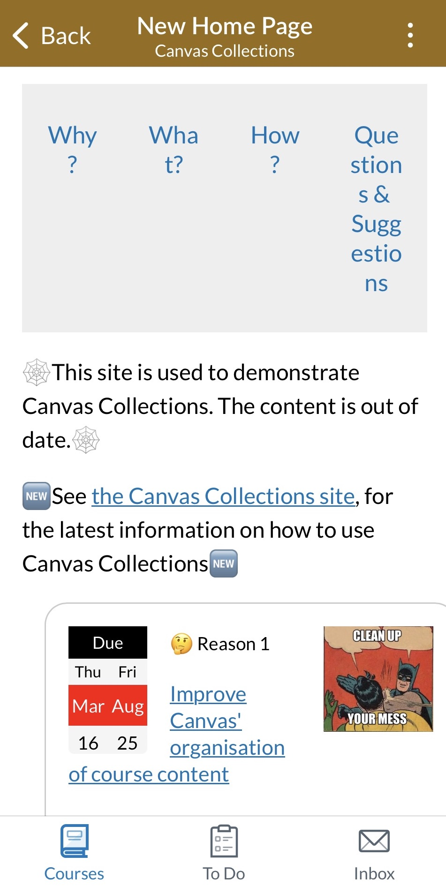
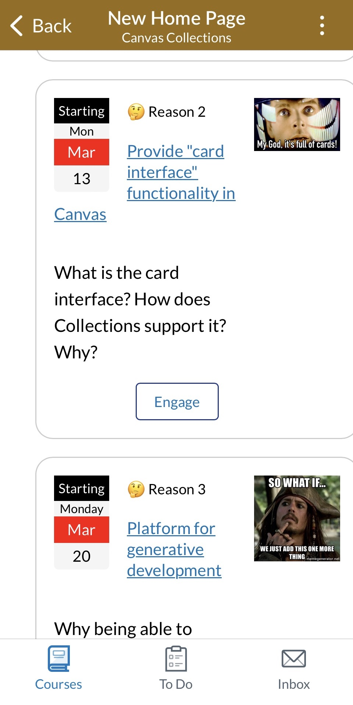

<!--
 Copyright (C) 2023 David Jones
 
 This file is part of Canvas Collections.
 
 Canvas Collections is free software: you can redistribute it and/or modify
 it under the terms of the GNU General Public License as published by
 the Free Software Foundation, either version 3 of the License, or
 (at your option) any later version.
 
 Canvas Collections is distributed in the hope that it will be useful,
 but WITHOUT ANY WARRANTY; without even the implied warranty of
 MERCHANTABILITY or FITNESS FOR A PARTICULAR PURPOSE.  See the
 GNU General Public License for more details.
 
 You should have received a copy of the GNU General Public License
 along with Canvas Collections.  If not, see <http://www.gnu.org/licenses/>.
-->

# Limitations

!!! Abstract "The main limitations of Canvas Collections"

    1. Collections is essentially not usable on the Canvas mobile apps (teacher or student) - not fully tested. [see more](#canvas-mobile-apps---essentially-not-usable)
    2. The Collections source code must be installed and active when visitors are using a web browser in order to configure Collections and navigate using "live" Collections [see more](#collections-installed-and-active---live-collections)
    3. Claytons (static) Collections can be used to navigate without the Collections source code, but some representations will require the ability to integrate additional CSS. [see more](#claytons-collections---no-code-but-some-css-may-be-required)

## Canvas mobile apps - essentially not usable

The Canvas mobile apps do [not (at least easily) support custom JavaScript/CSS](https://community.canvaslms.com/t5/Canvas-Mobile-Forum/iOS-app-and-Canvas/m-p/465811/highlight/true#M350). Meaning the Canvas apps do not allow you to configure Collections or navigate using live Collections.

Navigation with Claytons Collections does work somewhat in Canvas mobile apps, but the experience is not good due to the constrained space and the lack of support for external CSS. The following images illustrate perhaps the best case with Claytons Collections.

| Claytons Collections (tabs) | Claytons Collections (cards) |
| --- | --- |
| <figure markdown><figcaption>Top of a Claytons Collections home page showing compressed tabs - Canvas mobile app</figcaption>{:width="75%" style="text-align:center"} </figure> | <figure markdown><figcaption>Claytons Collections home page cards - Canvas mobile app</figcaption>{:width="75%"}</figure> |

## Collections installed and active - live Collections

Collection provides [configuration](../configure/overview.md) and [navigation](../navigate/navigate-options.md) functionality.

To configure Canvas Collections you must be using a Web browser with the Collections JavaScript [installed and active](../getting-started/install/is-it-installed.md). 

Collections provides [two navigation experiences](../navigate/navigate-options.md): live Collections and Claytons Collections. Live Collections requires the Collections JavaScript to be installed and active. 

## Claytons Collections - no code, but some CSS may be required

Navigating with Claytons Collections is essentially viewing a Canvas page with static HTML and CSS. No JavaScript is required. However, Canvas [limits what HTML and CSS](https://community.canvaslms.com/t5/Canvas-Resource-Documents/Canvas-HTML-Editor-Allowlist/ta-p/387066) can be used on Canvas pages.

Some [representations](../reference/conceptual-model/representations/overview.md) fit within those limits (e.g. the [_HorizontalCards_ representation](../reference/conceptual-model/representations/horizontal-cards.md)), but others do not (e.g. the [_GriffithCards_ representation](../reference/conceptual-model/representations/griffith-cards.md)). The latter will not display correctly without this HTML/CSS.

Adding the required HTML/CSS is difficult if not impossible for mobile app users ([see above](#canvas-mobile-apps---essentially-not-usable)). For web browsers, the relevant HTML/CSS can be installed either by the Canvas administrator, or by the teacher/designer where a tool like CIDI Labs Design Plus is available.

