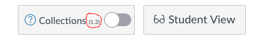

# Latest Version **1.3**

Version **1.3** of Canvas Collections is ready for use. It should work on any Canvas instance.

It has been tested in both [individual and institutional modes](../getting-started/install/how-to-install.md). 

## Which version are you using?

If Collections is [installed](../getting-started/install/is-it-installed.md) and you have a teacher/designer role (i.e. you can see the _Student View_ button on a Canvas course site) the Collections widget should be added to the top right of the Modules page (see the figure below). 

From version 1.3 onward, the version number should be visible (circled in red below). If you cannot see the version number, you are using an older version of Collections.

<figure markdown>
<figcaption>Canvas Collections widget with version number</figcaption>

</figure>

