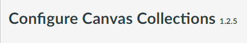

# Latest Version **1.1.0**

Version **1.1.0** of Canvas Collections is ready for use. While it should work on any Canvas instance, there are some features (e.g. dates) that are specific to Griffith University (to be fixed soon).

It has been tested in both [individual and institutional modes](../getting-started/install/types-pre-requisites.md). 

## Which version are you using?

If you have a teacher/designer role (i.e. you can see the _Student View_ button) you can check which version by opening the Collections configuration section as illustrated below. The version number (circled in red) will then be visible.

<figure markdown>
<figcaption>Where to find Collection's version number</figcaption>
  
</figure>
