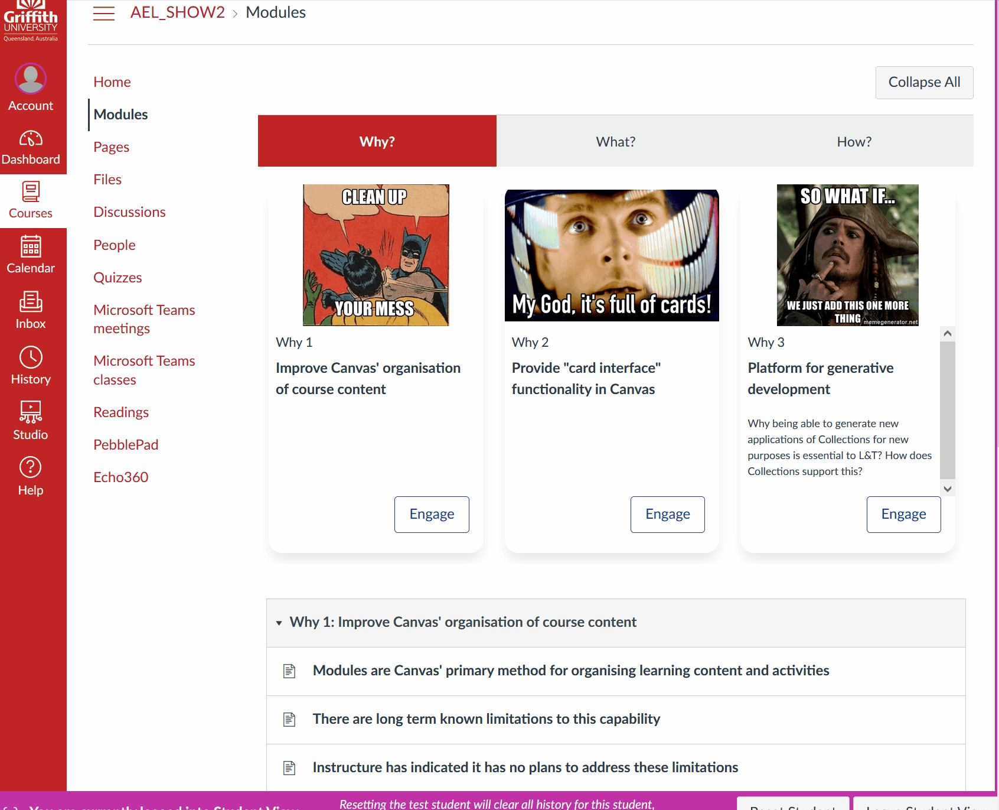

# Features & Use

## Three Features

Canvas Collections currently modifies the Canvas Modules page through three main features:

1. [Collections](./features/collections.md)

    Group related modules into collections of modules.

2. [Representations](./features/representations.md)

    Transform the standard linear and text-based visual representation of a collection of modules into one of a set of available representations. 

3.  [Objects](./features/objects.md)

    Specify additional properties (e.g. a date, label, picture, description) for any Canvas module. The idea is that these properties help transform a vanilla Canvas Module into a context specific object.

## Two types of use

Canvas Collections supports two types of use.

### "Live" Collections

Meaning that the Collections Javascript code is live and actively modifying what you see when viewing the Canvas Modules page. Requires that the Collections Javascript code is [installed via one of two different means](./getting-started/install/types-pre-requisites.md).

The following animated example demonstrates how the live version of Collections modifies the Modules page of a Canvas course site. The user is able to navigate between different collections and use the representation to access specific modules.

### "Claytons" Collections

Meaning that the Collections Javascript is **not** live. Instead, Canvas Collections has been used to modify one or more Canvas pages to emulate the Collections interface. i.e. Canvas Collections helps implement common advice in the Canvas community to a) [create full navigation using Pages](http://lisahistory.net/wordpress/2020/06/working-against-canvas-three-tips/), or b) [create an inviting course home page].

The following example demonstrates how "live" Collections is used to create a "Claytons" version, the process includes these steps:

1. First the name of an _output page_ is identified.

    This is a normal Canvas page - in this case the home page of the course site - that will be modified to include the Collections representation.

2. Use _Full Claytons_ to place a full emulation of Collections to the _output page_.

    Each Collection is specified as having the same _output page_ using the page's name. Once this is done, _Full Claytons_ (with the _Tabs_ navigation option) is used to update the _output page_.

3. The newly updated home page is visited and the interface used.

    Clicking the _Engage_ button of any of the cards will take the user directly to the associated Canvas module.

