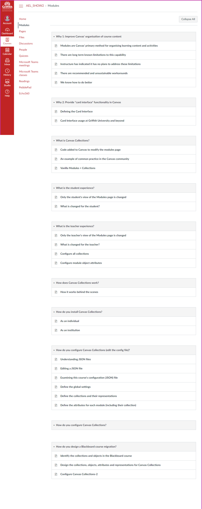
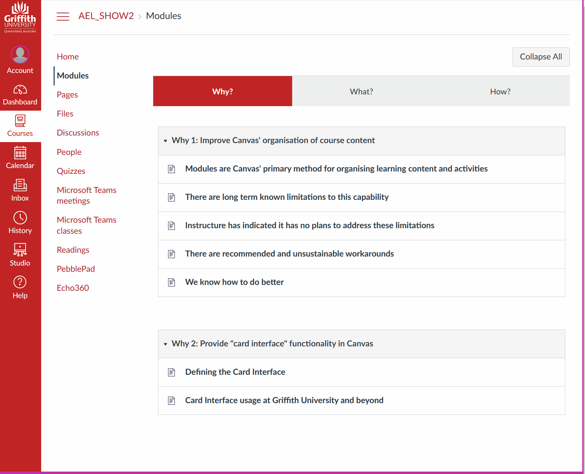

# Collections - grouping related modules

Standard Canvas provides a single list of Modules. You can change the order of the modules, but that's it. This causes problems if you have more than a few modules. The ability to create groups of modules is a [long requested feature](https://community.canvaslms.com/t5/Idea-Conversations/Modules-within-Modules/idc-p/461383) which is [not being provided by the vendor](https://community.canvaslms.com/t5/Idea-Conversations/Modules-within-Modules/idc-p/461383/highlight/true#M50428). 

Canvas Collections allows you to group modules into different **collections** (e.g. Content, Assessment). It displays a navigation bar that allows students to navigate between different collections, seeing and interacting only with the modules belonging to the visible collection.

### For example

The following table shows the student view of the same Modules page for the same Canvas course. The left-hand image shows the standard Canvas Modules page. A long list of modules and items. 

The right-hand animated image illustrates the case where Canvas Collections has been used to group the same modules into three collections: Why?, What?, and How?. Canvas Collections allows the student to navigate between the collections, seeing and interacting only with the modules belonging to the visible collection.

| Modules | Modules + Collections |
| :--- | :--- |
|   |  |
