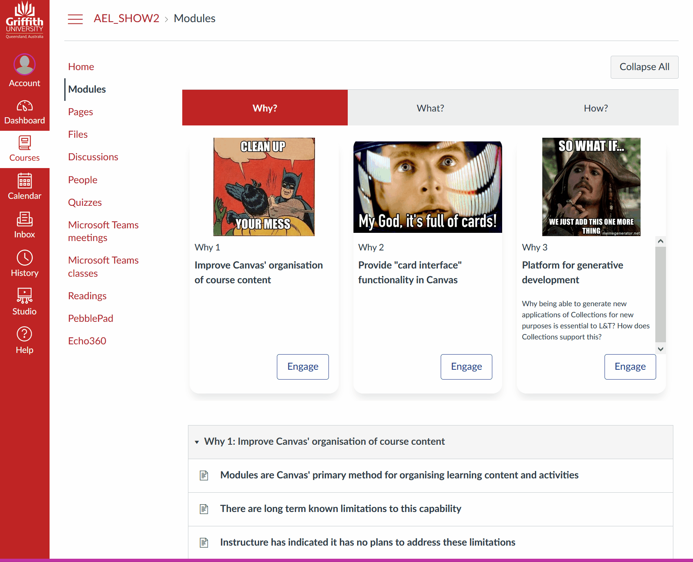

# Representations - transforming the visual design of modules

THe visual design of Canvas' modules view is linear and while visually clean it is somewhat uninteresting. A [common solution](https://learntech.medsci.ox.ac.uk/wordpress-blog/a-dashboard-view-of-modules-in-canvas/) to this within the Canvas community is to manually create a Canvas page to provide a more effective and purposefully design (e.g. ["Creating an inviting course home page"](https://community.canvaslms.com/t5/Canvas-Instructional-Designer/Creating-an-inviting-course-home-page/ba-p/267236); and, ["Home Sweet Homepages without Tables"](https://community.canvaslms.com/t5/Canvas-Instructional-Designer/Home-Sweet-Homepages-without-Tables/ba-p/275079))

[Canvas Collections' **representations**](../reference/representations/overview.md) provide different ways of visually displaying the same information. Currently there are three different representations. However, Collection is designed to support additional representations.

Each **collection** can be configured to use a different **representation**. The chosen **representation** can be changed at any time. Though some **representations** may require [objects](objects.md) to have specific properties to function fully.

### Examples

Below are two examples of Collections' representation feature. Both examples are using the same course site and the same set of modules. The very same course used in all the feature examples. 

#### Different Modules - Different representations 

For this example, the three collections are each using a different representation. 

1. The _Why?_ collection is using the _Griffith Cards_ representation. 

    This representation provides a common [card-based representation](https://thenextweb.com/news/how-cards-are-taking-over-web-design). Each module represented by a card that includes the module title, a description, a picture, and, a label & label number (_Why 2_).

2. The _What?_ collection is using the _Assessment Table_ representation. 

	This representation is intended for modules being used to represent assessment items (e.g. assignments, exams etc.). Hence it provides columns for weighting and due dates.

3. The _How?_ collection is using the _Collections Only_ representation.

	As the name suggests, this representation shows just the collection name and the modules that belong to the collection. It provides no other representation.

 

#### All using Griffith Cards 

For this example, all three collections are using the _Griffith Cards_ representation. Generating this example involved changing the representation for the _What?_ and _How?_ collections using a menu. No other changes.

 