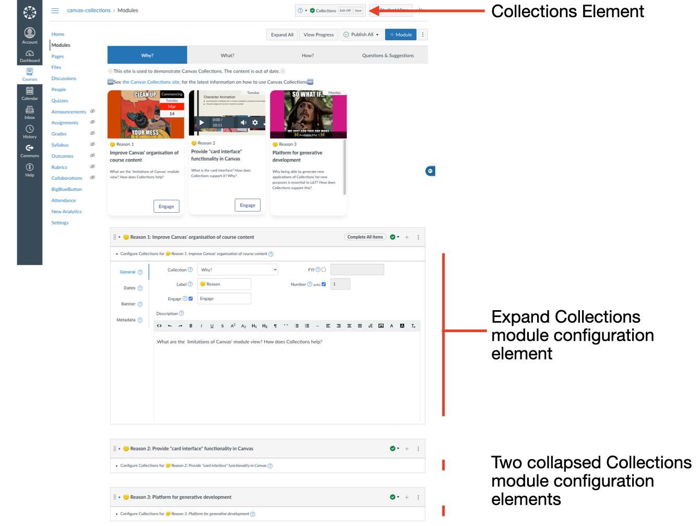
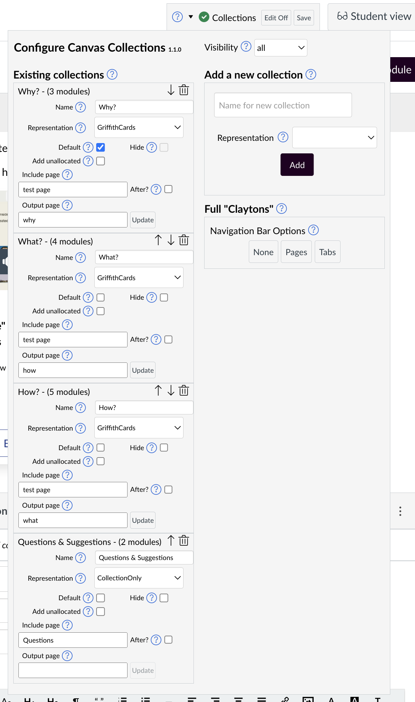

# Configuration

The task of configuration Collections is more complex than navigating. Consequently, the Collections configuration interface elements are more complex.

!!! note "Only visible to certain people at certain times"

	The configuration interface is only visible to people who are [able to edit collections](../../../../reference/lifecycle/edit/).
	
=== "Overview"

	The configuration interface stretches across the whole modules page. The following summary and visual provides an overview. See other tabs for more detail (click on the figure to see a bigger version).

	| Element | Description |
	| ---- | ----- |
	| Collections element | 
A small element always present whenever Collections is installed and the modules page is being viewed by someone who can edit Collections.

The Collections element provides an indication of the current state of Collections and provides access to the collections configuration element.
 |
	| Collections module configuration | 
Every module will have its own Collections module configuration element. It is used to add and modify data about the module that will be used by Collections.

These can be expanded and collapsed as required.
 |

	<figure markdown>
	<figcaption>Overview of the Collections configuration interface across the entire modules page</figcaption>
	
	</figure>

=== "Collections element"

	If Collections is installed and you are able to edit Collections, you will always see the Collections element at the top off the modules page. To the left of the _Student View_ button. The Collections element provides an indication of the current state of Collections and provides access to the collections configuration element. The following figured represent some of the different states of the Collections element.

	|     |      | 
	| ---- | ----- |
	| <figure markdown> <figcaption>Collections has never been turned on for the course.</figcaption>   </figure> | <figure markdown> <figcaption>Collection is turned on and "published" (students can see the Collections navigation interface)</figcaption>   </figure> |
	| <figure markdown> <figcaption>Collections is turned on, but the visibility is set to no-one (the **red** unpublished icon).</figcaption>   </figure> | <figure markdown> <figcaption>Collections is on, visibility is no-one, and the Collections configuration page is unpublished</figcaption>   </figure> |

	<figure markdown>
	<figcaption>Collections is turned on, visible to all, and is in edit mode</figcaption>
	  
	</figure>

=== "collections configuration element"

	The collections configuration element is how you configure collections and perform other course level tasks. It has a number of sub-components summarised in the following table, illustrated below, and explained in more detail elsewhere.

	It is accessed by clicking on the _arrow_ icon in the Collections element with _Edit on_. It drops down over the top of the modules page.

	| Sub-component | Description |
	| ---- | ----- |
	| Title & version | 
Are you using the [latest version of Collections](../../../../latest-version/)?
 | 
	| [Visibility](../../../../reference/lifecycle/visibility/live/) | 
Allows visibility - who can see the Collections navigation interface - to be set to one of four values
 | 
	| [Existing Collections](../../../../reference/conceptual-model/collections/existing-collections/) | 
A list of all the current collections configurated for the course. Allowing you to modify them, delete them, change the order etc.
 |
	| [Add a new collection](../../../../reference/conceptual-model/collections/add-new-collection/) | 
Choose a name and a representation and add another collection to the course.
 | 
	| [Full "Claytons"](../../../../reference/conceptual-model/full-claytons/) | 
When configured, generate a static version of the Collections navigation interface
 | 

	<figure markdown>
	<figcaption>The collections configuration element</figcaption>
	  
	</figure>

=== "Module configuration element"

