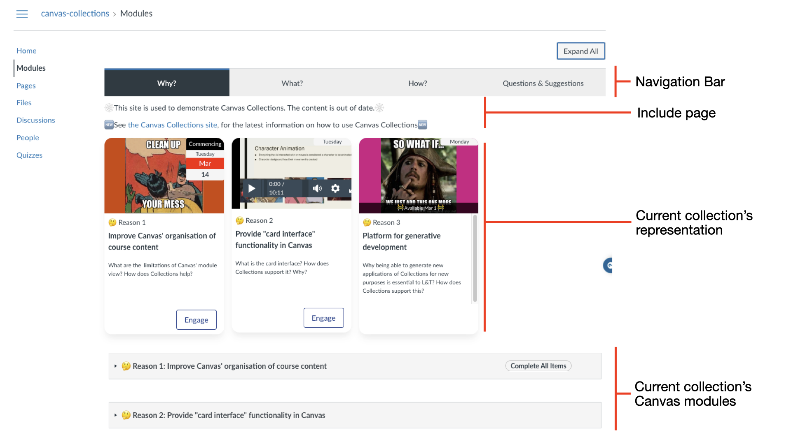

# Navigation

Navigation in Collections has two flavours: live and Claytons (static). The following summarises the live navigation experience.

## Navigating live Collections

Collections will make up to four navigation changes to the Canvas modules page. Who sees these changes is defined by Collections' [visibility setting](../../../../reference/lifecycle/visibility/overview/). 

The four changes are summarised in the following table and labelled in the image below.

See the [Navigating _Live_ Collections](../../../navigate/navigating-live-collections.md) page for more detail.

| Navigation element | Description |
| ---- | ----- |
| Navigation bar | 
Shows a list of all collections and allow navigation back and forth between collections. 
 |
| Include page (optional) | 
Each collection can have a single _Include page_. i.e. a Canvas page, the content of which will be inserted before or after the _Current collection representation_.

**Note:** Only the current collection's include page is shown.
 |
| Current collection's representation | 
Each collection chooses from one of the [available representations](../../../../reference/conceptual-model/representations/overview/) (including the _CollectionsOnly_ representation that is empty). These are designed to provide a bespoke visualisation of information about the Canvas modules.
  |
| Current collection's Canvas modules  | 
ALl of the above interface elements are placed before the normal list of modules displayed on the Canvas modules page. The one last change Collections makes is to hide all those modules that do not belong to the current collection (and other configuration choices).
 |

<figure markdown>
<figcaption>An example modules page modified with Collection's navigation interface elements</figcaption>

</figure>

## Navigating Claytons Collections

- doesn't occur on the modules page - occurce in Canvas pages

- Can have navigation bar or no or just be representations -- maybe show examples

See the [Navigating _Claytons_ Collections](../../../navigate/navigating-claytons-collections.md) page for more detail.

_Do up a video/screenshot for navigating Claytons_