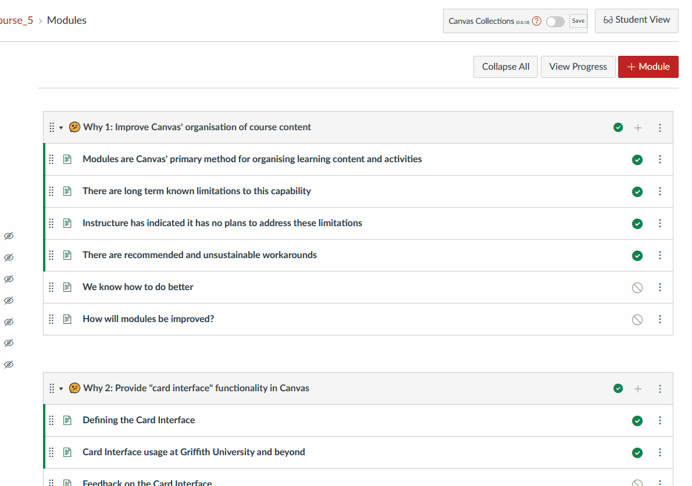

# Configuring collections

_Collections_ are used to organise modules into different groups (aka _collections_). By grouping and representing modules in course specific ways you can help your students understand and use your Canvas site.

Canvas Collections support for collections includes properties and operations. Both are leveraged to support your design.  Below there is a summary of the collection properties and operations and a summary of how to configure collections. For more insight, please refer to: 

- An [example of configuring collections](../..walk-throughs/../../walk-throughs/new/configure-collections.md) for a new course.
- The [collections reference page](../../reference/collections/overview.md).

## Collection properties

| Properties | Description |
| --- | --- |
| Name | Name is included in the navigation bar used to move between collections. Should be contextually meaningful and purposeful |
| Representation | If and what additional visualisation of the collections modules will be visible. There are currently [three options](../../reference/representations/overview.md). |
| Default collection | The collection visitors see when they first visit the modules view. |
| Include page | The name of an existing Canvas course page. The content of this page will be included before the representation. |
| Output page | The name of an existing Canvas course page. The [Claytons representation](../../reference/representations/claytons/overview.md) of the collection will be written to this page when _updated_ or _Full Claytons_.  |

## Collection operations

| Operation | Description |
| --- | --- |
| Add | Add a new collection by providing a name and selecting a representation. |
| Delete | Remove a collection. The modules from the collection will remain. As will any module configuration information. |
| Re-order | Change the order in which collections are displayed in the navigation bar. |
| Hide | Prevent students from being able to see a collection and (easily) see the modules with in it.  **NOTE:: Do not use this feature to prevent student access to a module, use Canvas' publish option.|
| Update the output page | Modify the nominated output page (if there is one) with the latest representation of the collection. |
| Full "Claytons" | Modify the nominated output pages of all collections with an output page, including adding in a navigation bar on each page. |
| 🧪 Apply module labels ☠️ | **Experimental** Modify the name of each Canvas module in a collection to use the module [label](../../reference/objects/overview.md#label) and [number](../reference/../../reference/objects/overview.md#number) properties.  |

## How to configure collections

The primary steps are:

1. Make sure that Canvas Collections is turned on for the course.
2. Open the collections configuration area.
3. Use the collections configuration area to modify the collections properties and use the collections functionality.

The [example of configuring collections](../../walk-throughs/new/configure-collections.md) provides more detail on how to configure collections. The following animated image provides a simple demonstration.

