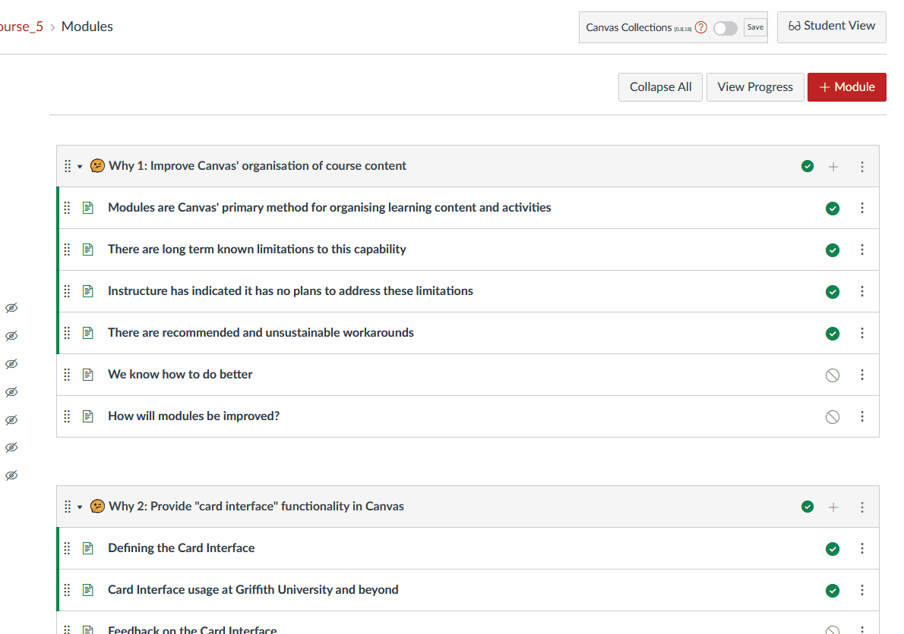

# Modules - configure

Canvas Collections provides additional module properties. These help transform vanilla Canvas modules into context and design specific objects (e.g. workshop, topic, lecture, etc) as part of your Canvas site. These properties are then used by Canvas collections to modify how these objects (aka Modules) are represented to visitors.

Below is a summary and simple demonstration of these properties. For more insight, please refer to:

- An [example of configuring modules](../../walk-throughs/new/configure-modules.md) for a new course.
- The [objects reference page](../../reference/objects/overview.md).

## Module properties

| Properties | Description |
| --- | --- |
| Collection | Which of the collections the module belongs to. |
| [Description](../../reference/objects/overview.md#description) | A short collection of HTML that can be used to describe the why, how, what or other relevant information students need to know about the module. |
| [Banner](../../reference/objects/overview.md#banner) | When using a cards representation, each module can be represented by a banner, which can be either an [image](../../reference/objects/overview.md#image), a [background colour](../../reference/objects/overview.md#colour), or an [iframe](../../reference/objects/overview.md#iframe).  |
| [Label and number](../../reference/objects/overview.md#labels-and-numbers) | The label is typically used to explicitly identify the module as a particular type of object. The number specifies the sequence of related objects. e.g. Lecture 1, Lecture 2 |
| Date (or date range) and date label | Hint to students when the object will become important. |  
| Additional metadata | Open ended list of name/value pairs used to provide any additional metadata. |

## How to configure a module

The primary steps are:

1. Make sure that Canvas Collections is turned on for the course.
2. Move to the module you wish to configure.
3. Open the Canvas Collections module configuration area.
4. Use the module configuration area to modify the module properties.

The [example of configuring modules](../../walk-throughs/new/configure-modules.md) for a new course provides a more detailed description of these steps. The following animated image provides a simple demonstration.

