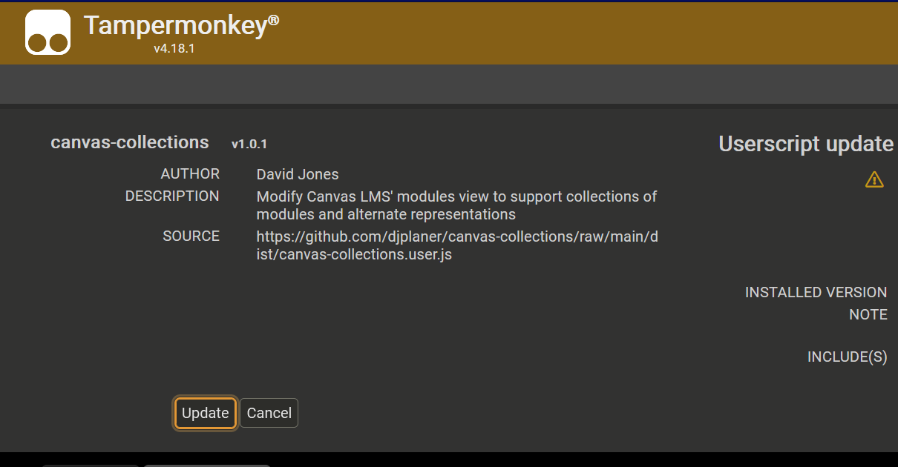
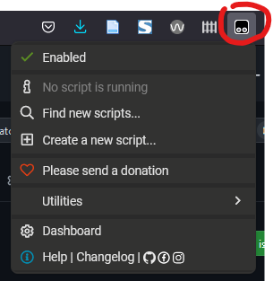
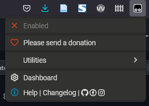
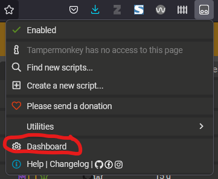
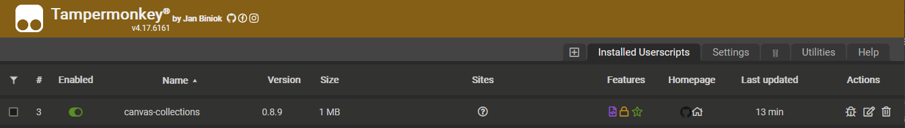

# Individual Install

An individual install adds Canvas Collections to a web browser. Once complete, every time you use that web browser you will be able to use Canvas Collections.

An individual install is a two step process:

1. Install a userscript manager - for example, [TamperMonkey](https://www.tampermonkey.net/)
2. Install the [canvas-collections userscript](https://github.com/djplaner/canvas-collections/raw/main/release/canvas-collections.user.js)

> :question: You install a [userscript manager](https://en.wikipedia.org/wiki/Userscript_manager) into your web browser (not surprisingly) to help manage [userscripts](https://en.wikipedia.org/wiki/Userscript). Small Javascript programs that your browser will run when you view specific web pages. Userscripts customise those web pages to better suit your purposes. e.g. to modify the Canvas modules view by adding Collections.

## Install a userscript manager - TamperMonkey

[TamperMonkey](https://www.tampermonkey.net/) is a widely used userscript manager. It can be used on most modern web browsers. 

### Visit the [Tampermonkey home page](https://www.tampermonkey.net/).

You should see instructions for downloading (installing) TamperMonkey for your web browser. e.g. the following image for the Firefox browser

  

### Click on the left-hand _Download_ button

As shown above, you can choose to download the stable (left-hand download button) version of TamperMonkey or the BETA (right-hand download button) version. The stable version is recommended.

You will be taken to your web brower's [extension or add-on service](https://en.wikipedia.org/wiki/Browser_extension).

### Follow the instructions to add Tampermonkey to your web browser

Each web browser’s browser extension installation process will be a little different. In general, it will provide you with details of what permissions the browser extension (Tampemonkey in this case) wishes to have and provides you with the option to install.

## Install canvas-collections userscript

With TamperMonkey installed you can now install [the canvas-collections userscript](https://github.com/djplaner/canvas-collections/raw/main/release/canvas-collections.user.js). Just click on that link.

If all is working you should something like the following image. An image showing TamperMonkey providing you with details of the userscript and asking if you wish to install it.

  

## Turning canvas-collections off

There are three ways to prevent canvas-collections from modifying your view of Canvas modules pages:

1. Remove TamperMonkey (or your userscript manager)

    The [TamperMonkey home page](https://www.tampermonkey.net/) includes a video (at the bottom of the page) that demonstrates how to remove it from your specific web browser.

2. Disable TamperMonkey (or your userscript manager)
3. Disable or remove the canvas-collection userscript

The last two ways rely on using the TamperMonkey icon added to your web browser's toolbar - see the following image.

  

### Disable TamperMonkey

Click the _Enabled_ option shown in the image above to disable TamperMonkey - see the following image. With TamperMonkey disabled, Canvas Collections will not be run.

  

### Disable or remove the Canvas Collections userscript

By accessing the TamperMonkey _dashboard_ you can disable specific userscripts, including Canvas Collections. The _dahsboard_ is an option provided via the TamperMonkey icons - see the following image.

  

Clicking on the _dashboard_ option will open the TamperMonkey dashboard. The dashboard will show you all the userscripts you have installed and provide options to 

- enable/disable a userscript; and,

    Note the _Enabled_ column in the following image. Click on the switch to enable/disable a userscript.
- remove a userscript.

    Note the trashcan icon in the _Actions_ column in the following image. Click on the trashcan icon to remove a userscript.

  