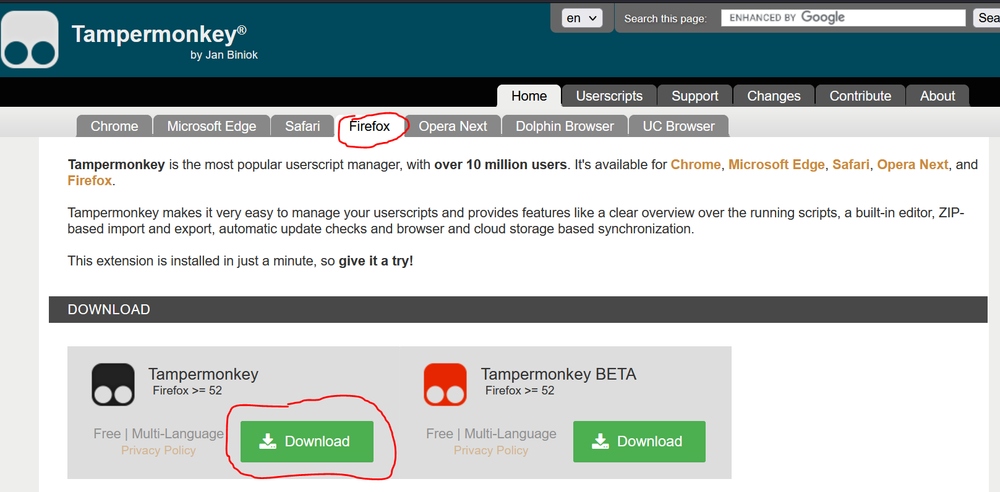

# Individual Installation (and uninstall)

An _individual_ installation means Collections is only working for you. Only you (or anyone else who with an _individual_ installation) can see Collections.

To do this Canvas Collections is installed into your web browser as a [userscript](https://en.wikipedia.org/wiki/Userscript). 

!!! Note "About userscripts and userscript managers"

    You install a [userscript manager](https://en.wikipedia.org/wiki/Userscript_manager) ([Step #1](#1-install-a-userscript-manager)) into your web browser (not surprisingly) to help manage [userscripts](https://en.wikipedia.org/wiki/Userscript). Small Javascript programs that your browser will run when you view specific web pages. Userscripts customise those web pages to better suit your purposes. e.g. to modify the Canvas modules view by adding Collections.

## Installation

There are three steps for an individual installation

### 1. Install a userscript manager

[TamperMonkey](https://www.tampermonkey.net/) is a widely used userscript manager. It can be used on most modern web browsers. 

#### 1.1 - Visit the [Tampermonkey home page](https://www.tampermonkey.net/)

You should see instructions for downloading (installing) TamperMonkey for your web browser. e.g. the following image for the Firefox browser

<figure markdown>
<figcaption>Tampermonkey home page for Firefox</figcaption>
  
</figure>

#### 1.2 - Click on the left-hand _Download_ button

As shown above, you can choose to download the stable (left-hand download button) version of TamperMonkey or the BETA (right-hand download button) version. The stable version is recommended.

You will be taken to your web brower's [extension or add-on service](https://en.wikipedia.org/wiki/Browser_extension).

#### 1.3 - Follow the instructions to add Tampermonkey to your web browser

Each web browser’s browser extension installation process will be a little different. In general, it will provide you with details of what permissions the browser extension (Tampemonkey in this case) wishes to have and provides you with the option to install.

### 2. Install the Collections userscript

With TamperMonkey installed you can now 

<sl-button variant="success" size="small" href="https://github.com/djplaner/canvas-collections/raw/main/dist/canvas-collections.user.js">Install the <strong>Collections userscript</strong></sl-button>

    
If all is working you should something like the following image. An image showing TamperMonkey providing you with details of the userscript and asking if you wish to install (or perhaps update) it.

<figure markdown>
<figcaption>Installing the Canvas Collections userscript</figcaption>
)  
</figure>

### 3. Does it work?

It you've successfully completed these steps, the check out the [Is it installed? page](../install/is-it-installed.md) for how to check if Canvas Collections is working.

## Disable or Uninstall Collections

There are four methods to prevent Canvas Collections from modifying your view of Canvas modules pages.

| Method | Result | Description |
| --- | --- | --- |
| Remove TamperMonkey | Uninstallation | The [TamperMonkey home page](https://www.tampermonkey.net/) includes a video (at the bottom of the page) that demonstrates how to remove TamperMonkey from your web browser. This also uninstalls Collections.|
| [Disable TamperMonkey](#disable-tampermonkey) | Disable | TamperMonkey | Turn TamperMonkey off. It remains, but will not run any userscripts, including Canvas Collections |
| [Remove Canvas Collections userscript](#disable-or-remove-the-canvas-collections-userscript) | Uninstall | If you use TamperMonkey for other purposes, you can remove just the Canvas Collections userscript |
| [Disable Canvas Collections userscript](#disable-or-remove-the-canvas-collections-userscript) | Disable | Turn off the Collections userscript so it doesn't run. |

### TamperMonkey icon

The last three ways rely on using the TamperMonkey icon added to your web browser's toolbar - see the following image. 

!!! warning "TamperMonkey icon may not appear in the toolbar"

    Not all browser extensions (e.g. TamperMonkey) will appear in your browser's toolbar. You may need to user more detailed, browser specific steps to find the TamperMonkey icon.

<figure markdown>
<figcaption>Opening the Tampermonkey browser dropdown</figcaption>
  
</figure>

### Disable TamperMonkey

Click the _Enabled_ option shown in the image above to disable TamperMonkey - see the following image. With TamperMonkey disabled, Canvas Collections will not be run.

<figure markdown>
<figcaption>Tampermonkey disabled</figcaption>

</figure>

### Disable or remove the Canvas Collections userscript

By accessing the TamperMonkey _dashboard_ you can remove or disable specific userscripts, including Canvas Collections. The _dashboard_ is an option provided via the TamperMonkey icons - see the following image.

<figure markdown>
<figcaption>How to open the Tampermonkey dashboard</figcaption>
  
</figure>

Clicking on the _dashboard_ option will open the TamperMonkey dashboard. The dashboard will show you all the userscripts you have installed and provide options to 

- enable/disable a userscript; and,

    Note the _Enabled_ column in the following image. Click on the switch to enable/disable a userscript.
- remove a userscript.

    Note the trashcan icon in the _Actions_ column in the following image. Click on the trashcan icon to remove a userscript.

<figure markdown>
<figcaption>Viewing the Tampermonkey dashboard</figcaption>

</figure>

<link rel="stylesheet" href="https://cdn.jsdelivr.net/npm/@shoelace-style/shoelace@2.0.0/dist/themes/light.css" />

