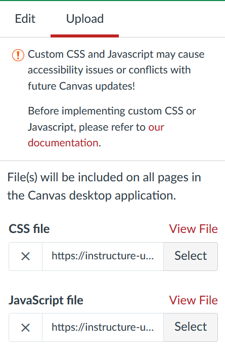

# Institution install Collections

Canvas Collections is a Javascript application. A combination of Javscript and CSS that together modifies the Canvas modules page.

The [Canvas theme editor](https://community.canvaslms.com/t5/Video-Guide/Theme-Editor-Admins/ta-p/383021) allows authorised people to include additional Javascript and CSS into a Canvas theme. This theme is then applied to course sites and Collections is available for use.

## The required files

The [`dist`](https://github.com/djplaner/canvas-collections/tree/main/dist) folder in the Canvas Collections GitHub repo contains the necessary files:

1. [canvas-collections.js](https://github.com/djplaner/canvas-collections/blob/main/dist/canvas-collections.js), and
2. [canvas-collections.css](https://github.com/djplaner/canvas-collections/blob/main/dist/canvas-collections.css).

These are produced when building Canvas Collections.

## One approach - upload these two files

As shown in the following figure, the Canvas Theme editor provides methods to upload a CSS and JavaScript file to a theme. Install Collections by uploading the Collections files via these means

<figure markdown>
<figcaption>CSS and JavaScript file uploads in the Canvas Theme editor</figcaption>
)  
</figure>