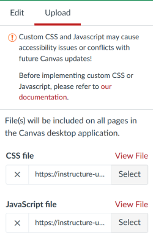

# Collections: Institutional installation

## Background

An institutional installation of Canvas Collections involves using the [Canvas Theme Editor](https://community.canvaslms.com/t5/Admin-Guide/How-do-I-create-a-theme-for-an-account-using-the-Theme-Editor/ta-p/242) to add the Collections JavaScript and CSS files to your institution's Canvas instance.

Typically, your institution will have specific policies and practices governing which, how and where such files will be hosted. The following provides the bare basics of how to achieve this.

## 1. Download (or build) the required files

The Collections GitHub repository does include a recent copy of these files which you can download and use. The files are:

1. [canvas-collections.js](https://raw.githubusercontent.com/djplaner/canvas-collections/main/dist/canvas-collections.js) - the code implementing Collections, and
2. [canvas-collections.css](https://raw.githubusercontent.com/djplaner/canvas-collections/main/dist/canvas-collections.css) - the CSS declarations specifying the look and feel of Collections.

You can also build your own version of these files. See the [local development page](../../reference/development/local-development/overview.md) for more.

## 2. Upload those files using the theme editor

The [Canvas theme editor](https://community.canvaslms.com/t5/Video-Guide/Theme-Editor-Admins/ta-p/383021) allows authorised people to include additional Javascript and CSS into a Canvas theme. This theme is then applied to course sites and Collections is available for use.

The figure below shows the relevant portion of the Themes Editor. Use the relevant file upload elements to upload the files you downloaded in step 1.

<figure markdown>
<figcaption>CSS and JavaScript file uploads in the Canvas Theme editor</figcaption>
)  
</figure>
