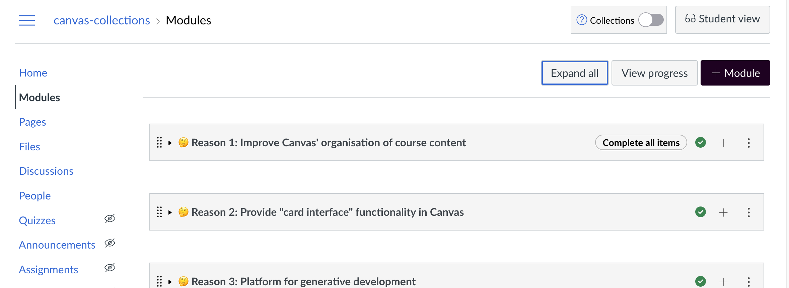

# Is Collections working? 

For Canvas Collections to work, you need to 

1. Have [installed Canvas Collections](../install/types-pre-requisites.md)
2. Have a [teacher](https://community.canvaslms.com/t5/Canvas-Basics-Guide/What-is-the-Teacher-role/ta-p/86) or [designer](https://community.canvaslms.com/t5/Canvas-Basics-Guide/What-is-the-Designer-role/ta-p/14) role in a Canvas course.

!!! note "Can you student the _Student View_ button?"

	If you can see the _Student View_ button when viewing the Modules page?
	
	Then Collections considers you have a teacher or designer role. Meaning you can configure Collections.

Then...

## Go to the Module view of the course site - 

If all is working, as a teacher or designer you should see the Canvas Collections box appear at the top of the page next to the _Student View_ button - circled in red in the following image.

<figure markdown>
<figcaption>Can you see Collections?</figcaption>
  
</figure>

## Turning it on

By default, Canvas Collections is turned off. Use the toggle to turn it on. Initially, you won't see much change, beyond a slight difference in the Collections configuration element.

!!! note "Has to be on to make changes"

	Collections will only modify the Canvas module view when it is turned on.

	Who will be able to see those changes is controlled by the visibility setting.

<figure markdown>
<figcaption>After you turn Collections on for the first time</figcaption>
  
</figure>

