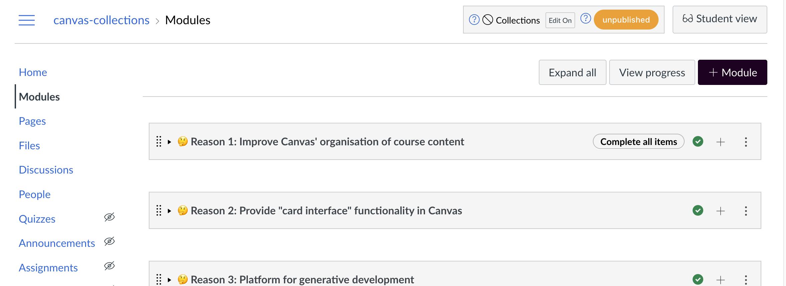

# Is Collections working? 

For Canvas Collections to work, you need to 

1. Have [installed Canvas Collections](../install/types-pre-requisites.md)
2. Have a [teacher](https://community.canvaslms.com/t5/Canvas-Basics-Guide/What-is-the-Teacher-role/ta-p/86) or [designer](https://community.canvaslms.com/t5/Canvas-Basics-Guide/What-is-the-Designer-role/ta-p/14) role in a Canvas course.

Then...

## Go to the Module view of the course site - 

If all is working, as a teacher or designer you should see the Canvas Collections box appear at the top of the page next to the _Student View_ button - circled in red in the following image.

  

## Turning it on

By default, Canvas Collections is turned off. Use the toggle to turn it on.

> **Note:** Collections will only modify the Canvas module view when it is turned on.

  

## Turning it off

Click on the toggle again to turn Canvas Collections off.
