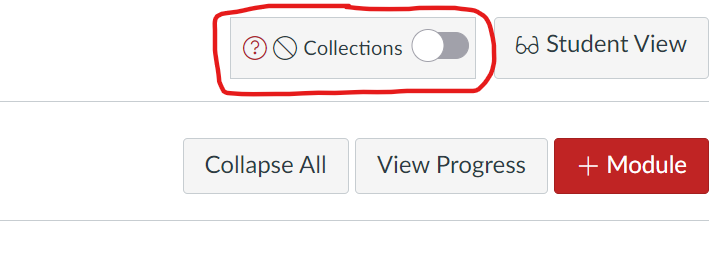

# Getting Started - Overview

The first two steps in getting started with Canvas Collections are listed below. 

Once you have these basics, move onto the [how-tos](../how-tos/available.md). In particular, the how-tos for [navigating a Collections course](../how-tos/navigating/overview.md) and [adding Collections to a course](../how-tos/new/overview.md).

=== "Install Collections"

    Canvas Collections is Javascript code that modifies the Canvas modules page. To use Canvas Collections you must first install Collections. There are [two different ways to install Collections](./install/types-pre-requisites.md)

    !!! tip "Is Collections already installed?"

        When you view the _Modules_ page of your Canvas site as teacher/designer (i.e. you can see the _Student View_ button), do you the _Collections Configuration_ container (circled in red below)?
    
        If so, then Collections is already installed!  

        <figure markdown>
        <figcaption>If you can see this, then Collections is already installed?</figcaption>
          
        </figure>

=== "Collections101 - Collections conceptual model"

    Understanding [the conceptual model](./101/overview.md) underpinning Canvas Collections will help you understand the relationship with Canvas modules and how to use Collections.

