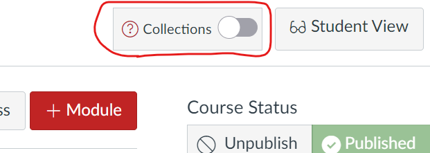

# Getting Started - Overview

!!! question "How do I get started with Canvas Collections?"

    There are three options below, your choice of

    1. _Install Collections_ - dive straight in, install it, use it, learn it.
    2. _Watch - Why, What, How?_ - [watch a 9 minute video](https://www.youtube.com/watch?v=_oSmPTUOhh8) demonstrating the why, what and how of Canvas Collections. 
    3. _Learn - Collections101_ - learn the conceptual model underpinning Canvas Collections.

!!! question "Then what?"

    If you've installed Collections, then the growing [list of how-tos](../how-tos/available.md) that provide more detailed introductions to common tasks, including:
    
    - How to [navigate Collections](../how-tos/navigate/overview.md); and,
    - How to [add Collections to a course](../how-tos/new/overview.md).

    The [Reference section](../reference/overview.md) provides more detailed information about Collections, including: the Collections lifecycle; conceptual model; features; and, how to start Collections development.
    
    Please also consider [contributing to the Collections community](../community/collections-community.md). If only to report a bug or suggest a new feature.

=== "Install Collections"

    Canvas Collections is Javascript code that modifies the Canvas modules page. To use Canvas Collections you must first install Collections. There are [two different ways to install Collections](./install/types-pre-requisites.md)

    !!! tip "Is Collections already installed?"

        When you view the _Modules_ page of your Canvas site as teacher/designer (i.e. you can see the _Student View_ button), do you the _Collections Configuration_ container (circled in red below)?
    
        If so, then Collections is already installed!  

        <figure markdown>
        <figcaption>If you can see this, then Collections is already installed?</figcaption>
          
        </figure>

=== "Watch - Why, What, How?"

    

	<iframe class="responsive-iframe" src="https://www.youtube.com/embed/_oSmPTUOhh8" title="YouTube video player" frameborder="0" allow="accelerometer; autoplay; clipboard-write; encrypted-media; gyroscope; picture-in-picture; web-share" allowfullscreen></iframe>
    

=== "Learn - Collections101"

    Understanding [the conceptual model](./101/overview.md) underpinning Canvas Collections will help you understand the relationship with Canvas modules and how to use Collections.

    | 101 section | Description |
    | --- | --- |
    | [Overview](101/overview.md) | Overview of the concepts underpinning Collections and its interface |
    | [Concepts](101/concepts.md) | Introduction to the main concepts of Collections: Canvas Modules; Collections; Representations; Objects; and Claytons. |
    | [Interface](101/interface.md) | Description of Collections' [navigation](101/navigation.md) and [configuration](101/configuration.md) interfaces.|

