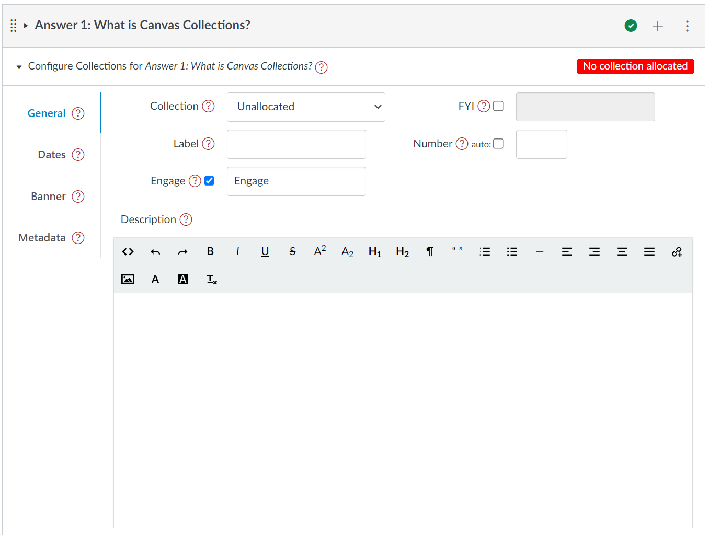
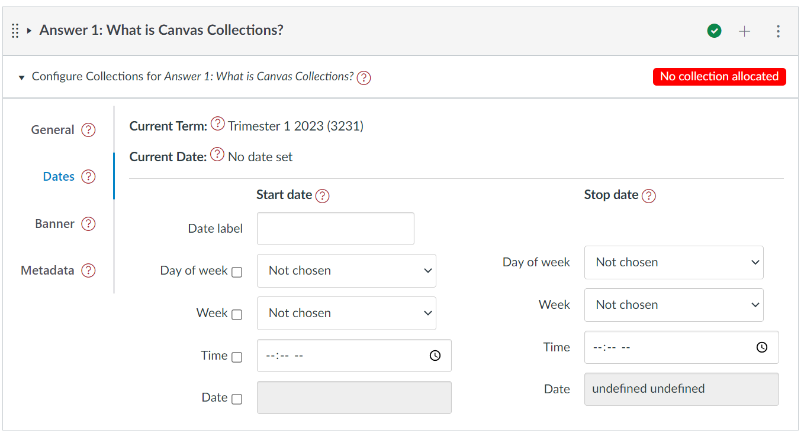
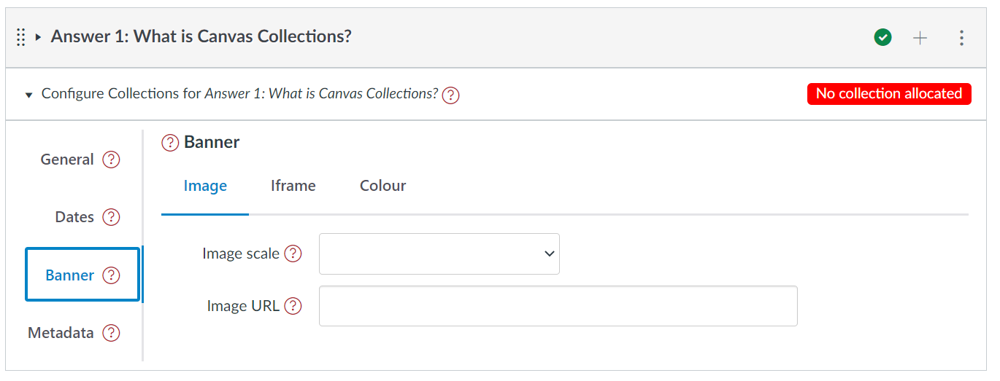
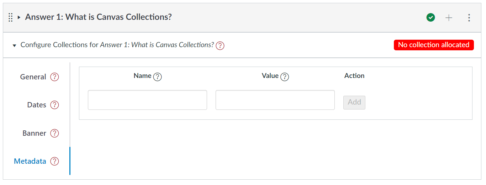

# Configure the modules

You have a course, you've turned Collections on, and you've designed and created a collection or two. The question answered here is

!!! question "How do you configure modules to work with Collections?"

Below you'll find three parts to this answer.

| Part | Description |
| ---- | ----------- |
| [**1. Introducing the module configuration area**](#1-introducing-the-module-configuration-area) | 
Where do you find it? What's there? How do you use it?
|
| [**2. Allocate a module to a collection**](#2-allocate-a-module-to-a-collection) | 
How to modify a module so it belongs (is allocated) to a particular collection.
 |
| [**3. Add more metadata to a module**](#3-add-more-metadata-to-a-module) | 
Start transforming a vanilla Canvas module into a design specific object by adding a description, label, banner and other metadata.
 |

## 1. Introducing the module configuration area

Once

1. Collections has been configured for a course; 
2. some collections have been added; and,
3. you have turned Collections _Edit On_.

Collections will add to each Canvas module (just under the module title) a module configuration element. This is how you configure each module. The following animated image illustrates.

<figure markdown>
<figcaption>Finding the module configuration areas</figcaption>
<sl-animated-image src="../pics/findModuleConfig.gif" alt="Finding the module configuration area" />
</figure>

<link rel="stylesheet" href="https://cdn.jsdelivr.net/npm/@shoelace-style/shoelace@2.0.0/dist/themes/light.css" />

### The components (tabs) of the Module configuration area

Each module configuration area has four tabs. Each tab helps you configure a different aspect of the module. Find out more about each tab below.

=== "General"

    The _General_ tab provides standard module configuration options. These include specifying the collection a module belongs to, its description, label etc.

    <figure>
    <figcaption>The general tab of the module configuration area</figcaption>
      
    </figure>

=== "Dates"

    Use the _Dates_ tab to associate a date or date range with a module. e.g. specifying availability, a due date, or when an activity occurs. Dates are specified based on weeks of an academic calendar.

    <figure>
    <figcaption>The dates tab of the module configuration area</figcaption>
      
    </figure>

=== "Banner"

    A module can be configured - using the _Banner_ tab - to have one of three types of banner (typically used by the _Cards_ representation), including:

    1. image - any image with a URL can be used.
    2. iframe - a standard embed code (e.g. a YouTube video).
    3. colour - a colour can be specified.

    <figure markdown>
    <figcaption>The banner tab of the module configuration area</figcaption>
      
    </figure>

=== "Metadata"

    Each of the other tabs are used to configure metadata that is designed for some pre-defined purpose. The _Metadata_ tab is used to manage generic metadata. Metadata that you may simply wish to store, or that may be used by a custom representation.

    <figure markdown>
    <figcaption>The metadata tab of the module configuration area</figcaption>
      
    </figure>

## 2. Allocate a module to a collection

The _General_ tab of a module configuration area contains a _Collection_ dropdown. This is used to allocate or re-allocate a module to one of the available collections. Once a module is allocated to a collection, it will only be visible when that collection is visible.

<figure markdown>
<figcaption>Allocating three modules to another collection</figcaption>
<sl-animated-image src="../pics/changeModuleAllocation.gif" alt="Allocating three modules to another collection" />
</figure>

## 3. Add more metadata to a module

The following table provides a summary of most of the metadata you can associate with a module.

| Metadata | Description |
| --- | --- |
| Description | 
Some HTML intended to provide a description or rationale for the object represented by the module
 |
| Image | 
A visual image to represent the module
 | 
| Label & Number | 
Explicitly identify (label) a module as a particular object and its position in the collection (the number - which can be auto calculated). For example, <em>Lecture 5</em> or <em>Assessment item 3</em>
 | 
| Date (period) & Date Label | Specify the day/time (or date period) when the activity occurs, is due etc. Through a combination of a date and a label (e.g. due, commencing etc) | 
| Additional metadata | A flexible method for specifying any additional metadata in the form of pairs of name and value | 
| FYI | 
Specify whether a module is intended as a "for your information" module. That is, a module for which students can see information about the module, but not the module itself.
 
 Useful if you want students to see details about a module that isn't released.
 |

Some examples follow.

!!! note "Metadata is typically displayed by a representation"

    Earlier on this page, the _Collections Only_ representation was used. This representation doesn't show any information about the modules. In the following examples, the _Griffith Cards_ representation is used.

=== "Add a description"

    The description is best used to provide students with additional information about what, why and how they might engage with the activities and information contained by a module. The description is a relative short piece of text entered using a simple visual editor under the description heading of the module configuration area.

    <figure markdown>
    <figcaption>Adding a description to a couple of modules</figcaption>
    <sl-animated-image src="../pics/addDescription.gif" alt="Adding a description" />
    </figure>

=== "Add an image or other banner"

    The ability to add an image to each module is a powerful way to improve the visual design of ca course and help student way finding by providing a strong, unique a visual representation of the module. 

    Collections uses two pieces of metadata to specify the image and how it is displayed:

    <figure markdown>
    <figcaption>Updating the banner for a module</figcaption>
    <sl-animated-image src="../pics/addBanner.gif" alt="Adding a banner - image and colour" />
    </figure>

=== "Add a label and a number"

    The label helps identify a Canvas module as a specific type of object (e.g. _Lecture_, _Workshop_, _Assignment_). It helps them visitors develop a conceptual understanding of why, what, and how to engage with the module/object.

    A module can have a label and a label number (e.g. _Lecture 1_, _Lecture 2_ etc)

    A label is simple any sequence of characters (including emojis).

    There are two options for the number: 
    1. _Auto-number_ - the number is automatically calculated based on the order of the modules in the collection. The first lecture will be _Lecture 1_ the second _Lecture 2_ and so on.   
    2. _Explicitly specified string_ - i.e. you can manually specify any sequence of characters, including emojis, or leave it blank.

    Labels and numbers can also work with the names of Canvas modules, as illustrated in the following.

    <figure markdown>
    <figcaption>Adding a label and number to three modules</figcaption>
    <sl-animated-image src="../pics/addLabel.gif" alt="Adding a label and number to three modules" />
    </figure>

=== "Add a date and date label"

    Course activities and objects are typically associated with specific dates or date periods. Using the _Date_ tab you can associate a date or date period with a module. 

    Currently, these dates are specified using generic dates (e.g. _Monday, week 5_, or _Wednesday, Week 7) for a university study period. Collections converts these to specific calendar dates based on a university academic calendar and the current Canvas course id. 

    !!! note "Currently, only some Griffith University academic calendars are support"

        To be useful, this feature must be customised to meet your specific contextual needs.

    <figure markdown>
    <figcaption>Adding a date</figcaption>
    <sl-animated-image src="../pics/addDate.gif" alt="Adding a date" />
    </figure>
