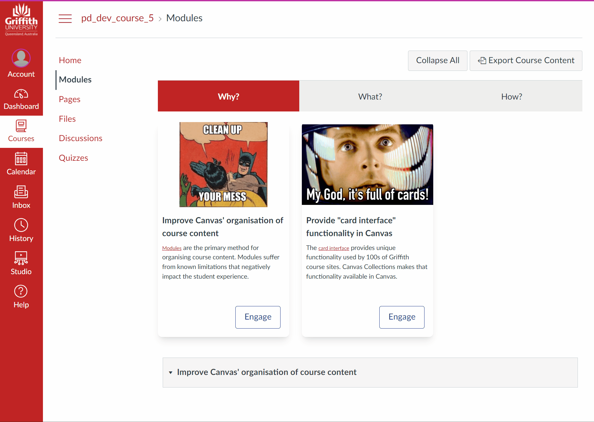

# Canvas Collections 

<h1>Html? <sl-icon name="plus-circle"></sl-icon> </h1>

   <sl-icon name="plus-circle">fred</sl-icon>
## Why and what?

The usability and visual design of a course web site impacts the experiences and outcomes of students. Existing functionality of [the Canvas LMS](https://community.canvaslms.com/t5/Canvas-Basics-Guide/What-is-Canvas/ta-p/45) places limits on both. Canvas Collections helps by extending [the Canvas Modules page](https://www.instructure.com/en-au/canvas/resources/all/how-to-use-modules-to-build-courses-in-canvas), the main Canvas tool for organising learning activities. 

The following images are of the Module page of the same Canvas course site. One vanilla Canvas, the other with Canvas Collections applied. Which strikes you as having better usabilty and visual design?

| Vanilla Canvas | Canvas Collections (live) |
| -------------- | ------------------ |
| [View full-size image](assets/vanillaModules.gif) | [View full-size image](assets/withCanvasCollections.gif) |
|  |  |

## Why is it important?

The ability for students to find what they need on a course site is important. [Crews et al (2017)](https://er.educause.edu/articles/2017/6/student-feedback-on-quality-matters-standards-for-online-course-design) report

> research has singled out findability as not only the most significant predictor of both self-efficacy and motivation among students in online courses, but the _only_ significant variable that predicts these two key factors.

## What are the limitations?

[Canvas Modules](https://www.instructure.com/en-au/canvas/resources/all/how-to-use-modules-to-build-courses-in-canvas) are the primary tool Canvas provides to help

> ...instructors structure course content by day, week, unit, topic or outcome. Modules help simplify student navigation through a course

The Canvas Community has long recognised that there are limitations of the Modules page. 

The following links provide a taste of what the Canvas Community has said.

### One long scrolling list

- [Too many Modules](https://community.canvaslms.com/t5/Canvas-Instructional-Designer/Too-many-Modules-Options-for-resorting-structuring-content/td-p/55983).
- [It may be overwhelming to see everything in your course on a single page - and presents a very linear view of a course](https://learntech.medsci.ox.ac.uk/wordpress-blog/a-dashboard-view-of-modules-in-canvas/).
- [The Modules view can get very long for students to scroll through](https://it.umn.edu/services-technologies/how-tos/canvas-decide-how-organize-your-course).
- [We are beginning to feel boxed in by the linear design of Course Modules](https://community.canvaslms.com/t5/Idea-Conversations/Modules-within-Modules/idi-p/357681/page/2).

### No context, narrative, visual design etc.

- [Modules don't provide a narrative to accompany the content](https://support.stedwards.edu/s/article/canvas-options-for-organizing-your-course).
- [The Modules view lacks visual appeal compared with the formatting options available in a Page](https://it.umn.edu/services-technologies/how-tos/canvas-decide-how-organize-your-course).
- [There is no way to express the time or theme oriented design of a course](http://lisahistory.net/wordpress/2020/06/working-against-canvas-three-tips/)

## What are the current solutions?

These issues are so prevalent that the widespread common advice within the Canvas Communit is to manually address these issues by [creating full navigation using pages](http://lisahistory.net/wordpress/2020/06/working-against-canvas-three-tips/), and [creating inviting course home pages](https://community.canvaslms.com/t5/Canvas-Instructional-Designer/Creating-an-inviting-course-home-page/ba-p/267236).

Similarly, the Canvas Community has provided various tools to help, both commercial and open source.

## How can Canvas Collections help?

Canvas Collections [provides features that can help](./features.md), including

1. Collections - avoid the long scroll by specifying collections of modules and showing one collection at a time.
2. Representations - add visual appeal and move away from linear design by selecting from or creating new ways of visually representing modules.
3. Objects - add narrative and other context and design specific details to modules by adding additional properties. 

Canvas Collections can also be used to create inviting Canvas pages that provide full navigation.

## Site map

The rest of the site expands on this in some detail. Use the following table as a map for what the rest of this site has to offer.

| Section | Purpose |
| --- | --- |
| [Features & Use](./features.md) | More detail of the features and use of Collections. |
| [Getting Started](./getting-started/overview.md) | Step-by-step guide to installing and early use of Canvas Collections |
| [Walk throughs](./walk-throughs/available.md) | Detailed walk throughs of common tasks using  Collections |
| [Reference](./reference/overview.md) | Reference documentation for Collections |
| [Related Work](community/related-work.md) | Work by others that has inspired and informed Collections |

