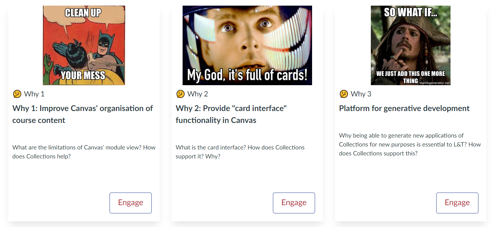
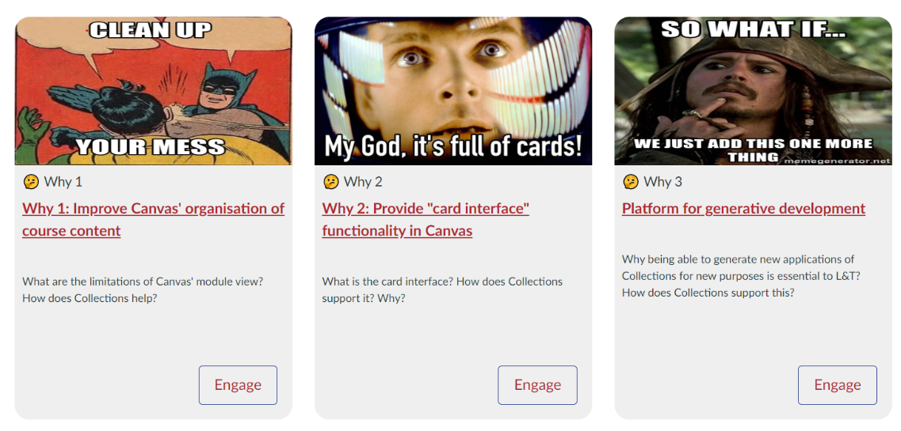
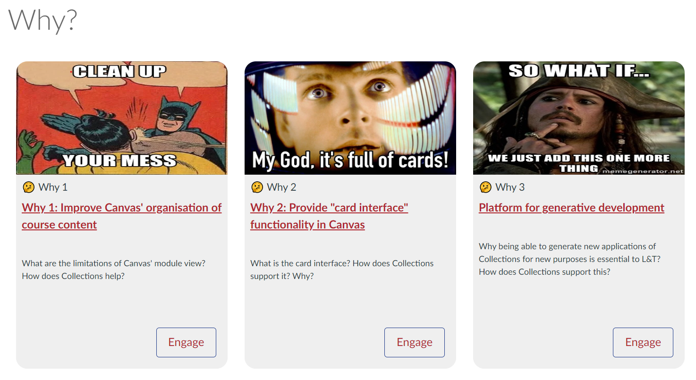
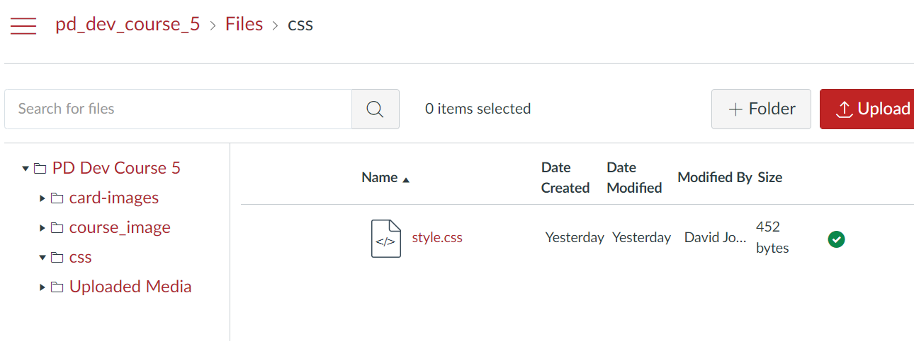
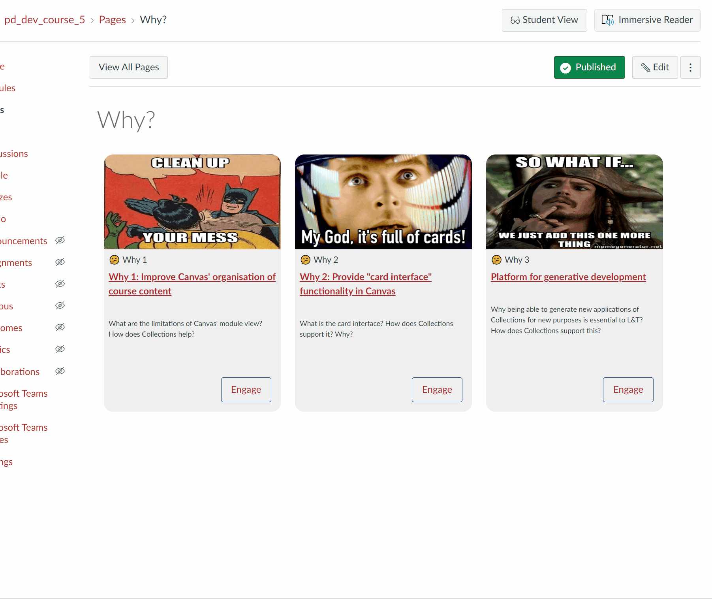

# Fix Claytons Card CSS - Scale images properly

## The Problem

The Card representation relies on various HTML/CSS features. This works well with the live version of Collections, but there are problems with the Claytons version. The following two images demonstrate. The differences include:

- The card images are not always scaled properly.
- There is now drop shadow on the Claytons version and hence the background colour is changed in response.
- The heading is transformed into a link that is less than visually appealing.
- The change in transparency when you hover over a card does not work in the Claytons version.

There is a way to fix this, if you have access to the Design Plus tool.

!!! note "Not on the Canvas Mobile app"

    The solution used here will not work on the Canvas Mobile app. Hence the view will default to the standard Claytons version.


| Live | Claytons |
| ---- | -------- |
|  |    | 


## The Cause

Claytons Collections writes HTML and CSS to a Canvas page. Canvas only allows certain types of HTML and CSS in the content of pages - specified in [this HTML Editor Allowlist](https://tr-learncanvas.s3.amazonaws.com/docs/Canvas_HTML_Editor_Allowlist.pdf). The CSS features used to implement the missing features are actively removed by Canvas.

## One Fix - Design Plus

If you have access to [the Design Plus product](https://cidilabs.com/landing/design-tools/) available on your Canvas courses site it is possible to leverage Design Plus' [custom CSS](https://cidilabs.instructure.com/courses/776/pages/custom-css) feature to add the CSS ```object-fit``` property back.

> ⚠️ **Note:** Design Plus' custom CSS feature will not work on the Canvas Mobile app.

### 1. Generate the Claytons Collections page 

First, you will need [set up "Claytons"](../new/set-up-claytons.md) and update the page with Claytons Collections. The following image is from the _Why?_ page of the example course.

  

### 2. Update(/add) the ```css/style.css``` file 

As outlined in the Design Plus [Custom CSS page](https://cidilabs.instructure.com/courses/776/pages/custom-css) the custom css features works by adding the contents of a ```css/style.css``` file in the Canvas site's files area. The file will need to exist in your course site and include the content of [this Card styles file](https://raw.githubusercontent.com/djplaner/canvas-collections/main/src/Collections/Views/cardStyle.css).



### 3. Turn on the custom CSS feature

The custom CSS features needs to be turned on for each page. The vendor provides [this documentation for the process](https://cidilabs.instructure.com/courses/102/pages/custom-css?module_item_id=3372). The following animated image demonstrates.

Starting with the Claytons page with the badly scaled images. The page is edited and with Design Plus available the Design Plus tools option is available in the top left hand corner. Open that and turn on the Custom CSS option.  Once turned on a the "Custom CSS On" label appears in the Canvas editor. Save the page and notice how the scaling of the images changes.



