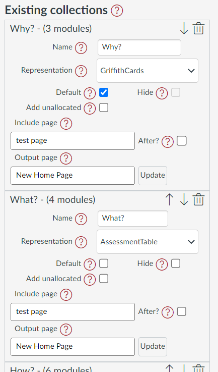

# Existing Collections

_Existing Collections_ is one component of an open [_Collections configuration dialog_](./overview.md) (e.g. the following image). It is used to configure the collections that have already been added to the course.

<figure markdown>
<figcaption>An example "existing collections" view</figcaption>

</figure>

## Features and Properties

_Existing Collections_ provides access to the following features and properties for each of the existing collections.

- what is the collection's name and number of allocated modules;
- change the order of collections;
- delete a collection;
- change the name of a collection;
- change the collections' representation;
- specify whether the collection should be: the default collection or hidden.
- specify that unallocated modules should be included in the collection's representation;
- specify a Canvas page that will be included in the collection's representation; and,
- specify an Canvas page to update with the collection's current representation.

### Name

Each collection must have a unique name. The name is displayed on the Collections navigation bar and provides a way to identify the collection. The name can include emojis.

In the _Existing collections_ element the collection's name will be shown both in the title (along with the number of modules currently allocated to the collection) and in the textbook you can use to change the name.

<figure markdown>
<figcaption>Making changes to a collection's name</figcaption>
<sl-animated-image src="../pics/animatedChangeCollectionName.gif" alt="Making changes to a collection's name" />
</figure>

### Representation

Each collection can select a [representation](../representations/overview.md) to visualise the collection's allocated modules. The representation can be changed at any time and as many times as necessary.

The _Existing collections_ element provides a menu that displays the current representation and allows you to choose another representation.

<figure markdown>
<figcaption>Changing a collection's representation</figcaption>
<sl-animated-image src="../pics/animatedChangeCollectionRepresentation.gif" alt="Changing a collection's representation" />
</figure>

### Default

The very first time someone visits the modules page with Canvas Collections they will be shown the _default_ collection. After that, the last collection they viewed will be shown.

!!! warning "One of the collections shown in _Existing collections_ must be set as the default collection."

!!! warning "The default collection cannot be hidden."

Each collection in the _Existing collections_ element has a _Default_ checkbox to indicate if it is the default collection. Select the _Default_ checkbox for another collection to specify that it is the default collection.

<figure markdown>
<figcaption>Changing the default collection</figcaption>
<sl-animated-image src="../pics/animatedChangeCollectionDefault.gif" alt="Changing the default collection" />
</figure>

### Hide

If you're still working on the configuration of a collection you may wish to _hide_ it from students. Each collection in the _Existing collections_ element has a _Hide_ checkbox to indicate if it is hidden. Select the _Hide_ checkbox for a collection to hide it.

!!! warning "You can not hide the _default_ collection"

<figure markdown>
<figcaption>Hiding a collection</figcaption>
<sl-animated-image src="../pics/animatedHideCollection.gif" alt="Hiding a collection" />
</figure>

### Add unallocated

Normally, the _representation_ for the current collection will only show modules that have been explicitly allocated to that collection. There are times when you may wish to include unallocated modules in a collection (i.e. modules that don't below to any collection).

The _Existing collection_ element provides a _Add unallocated_ checkbox to indicate if unallocated modules should be included in the collection's representation. Select the _Add unallocated_ checkbox to include unallocated modules in the collection's representation.

!!! tip "Use _unallocated_ if you want modules to appear in more than 1 collection"

<figure markdown>
<figcaption>Adding unallocated modules to a collection</figcaption>
<sl-animated-image src="../pics/animatedAddUnallocated.gif" alt="Adding unallocated modules to a collection" />
</figure>

### Include page

Each collection can have a Canvas page defined as its _include page_. The contents of an _include page_ will be inserted before or after that current collection's representation.

The _Existing collection_ element provides 

- an _Include page_ textbox in which you enter the title of the Canvas page; and,
- an _After_ checkbox which you use to indicate if you want the _include page_ contents to appear after the representation

<figure markdown>
<figcaption>Using the "include page" feature</figcaption>
<sl-animated-image src="../pics/animatedIncludePage.gif" alt="Using the include page feature" />
</figure>

### Output page

Each collection can also define a Canvas page as the _output page_. You can use Collections to update the contents of the _output page_ with the current representation of that collection. This can be done on as for a single collection, or use _Full Claytons_ to do it for all collections with an _output page_ defined.

The _Existing collections_ element provides 

- an _output page_ text box in which you enter the title of the Canvas page; and,
- an _Update_ button you use to update the _output page_ with the current representation of the collection.

<figure markdown>
<figcaption>Using the "output page" feature</figcaption>
<sl-animated-image src="../pics/animatedOutputPage.gif" alt="Using the output page feature" />
</figure>

## Other functions

The _Existing collections_ element also allows you to change the order of the collections and delete a collection.

### Changing the order of collections

Each of the collections in the _Existing collections_ element will have up/down arrow icons in the top right corner of that collection's section. Use these arrows to move the collection up or down the list of collections.

<figure markdown>
<figcaption>Changing the order of collections</figcaption>
<sl-animated-image src="../pics/animatedChangeCollectionOrder.gif" alt="Changing the order of collections" />
</figure>

### Deleting a collection

If you no longer require a collection you can delete a collection. Each collection in the _Existing collections_ element will include a trash can icon in the top left corner. Click on that icon to delete the collection.

!!! tip "Deleting a collection will not delete any of the modules that have been allocated to the collection, or modify any other module based configuration information."

<figure markdown>
<figcaption>Deleting a collection</figcaption>
<sl-animated-image src="../pics/animatedDeleteCollection.gif" alt="Deleting a collection" />
</figure>

<link rel="stylesheet" href="https://cdn.jsdelivr.net/npm/@shoelace-style/shoelace@2.0.0/dist/themes/light.css" />

