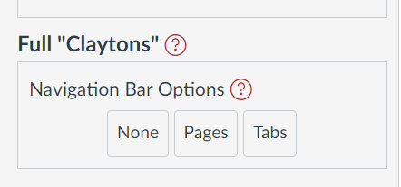

# Full Claytons

[_Claytons Collections_](../representations/claytons/overview.md) provides the ability to write the live Canvas Collections representation of a single or multiple collections to one or more Canvas pages. The purpose being to enable students and others to use the Collections representation without requiring the Collections code.

The _Full Claytons_ capability is accessed via the [_Collections configuration element_](../collections/overview.md).

<figure markdown>
<figcaption>An example _Full Claytons_ element from the _Collections configuration element_</figcaption>

</figure>

## How does _Full Claytons_ work?

_Full Claytons_ works by:

1. Identifying all of the [_existing collections_](../collections/existing-collections.md) that have a configured [_output page_](../collections/existing-collections.md#output-page).
2. Then using the [_navigation bar option_](#navigation-bar-options) button you pressed it will write the current representation of each collection (identified in step 1) to the specified _output page_

## Navigation Bar Options

The _navigation bar options_ for _Full Claytons_ specify if and how any navigation bar should be added to the _output page_. The combination of the chosen navigation bar option and how existing collections have used the _output page_ property will determine the end result.

| Navigation Bar Option | Description |
| --- | --- |
| `None` | No navigation bar will be added to any of the collections' _output page_. |
| `Pages`