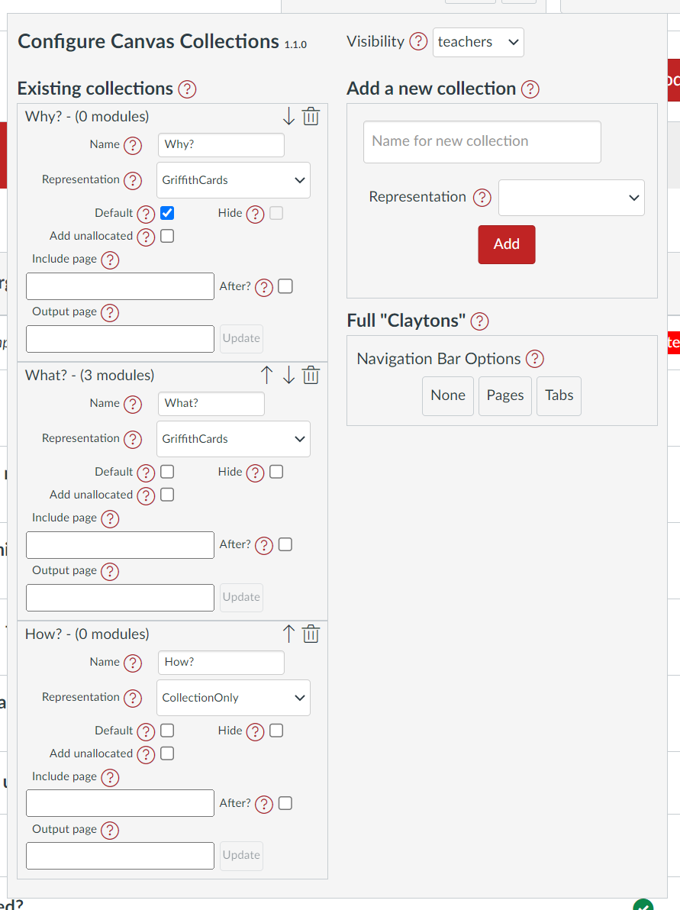

# Collections 

Collections are the key feature of Canvas Collections. They support organising Canvas modules into design and context specific groups of modules - a [feature long requested](https://community.canvaslms.com/t5/Idea-Conversations/Modules-within-Modules/idc-p/461383) by the Canvas Community.

The figure below is an example of a typical Collections configuration dialog. The following table provides a description of the major components of the dialog and a pointer to more information.

| Component | Description |
| --- | --- |
| Version number | 
Next to the <em>Configure Canvas Collections</em> title is the version number of Collections being used (e.g. <strong><small>1.1.0</small></strong>). This is useful for reporting bugs and identifying if you've the [latest Collections' version](../../../about/latest-version.md).
 |
| [Visibility](../../lifecycle/visibility/overview.md) | 
Specify to whom Collections will be visible.
 |
| [Existing collections](./existing-collections.md) | 
A list of the collections for this course. Use this to move and delete collections, change various collections values. 
 |
| [Add a new collection](add-a-new-collection.md) | 
Use this to add a new collection to the course.
 |
| [Full "Claytons"](./full-claytons.md) | 
How you can generate a ["Claytons" version](../representations/claytons/overview.md) of your course's Collections.
 |

<figure markdown>
<figcaption>A typical Collections configuration dialog</figcaption>
  
</figure>