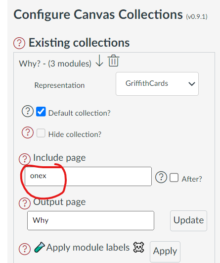
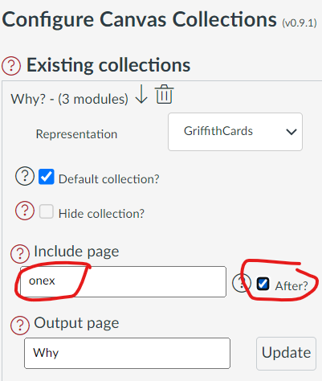
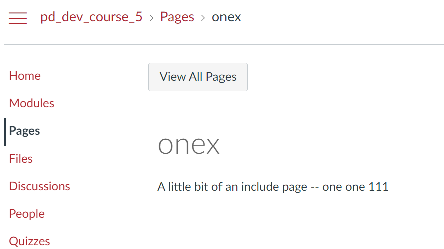
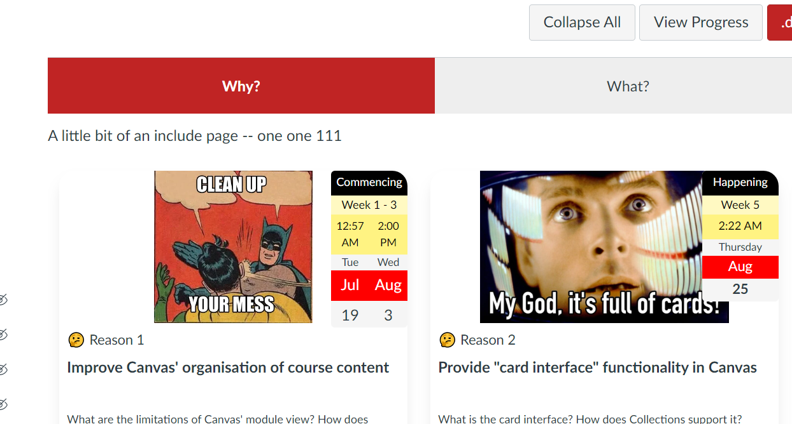
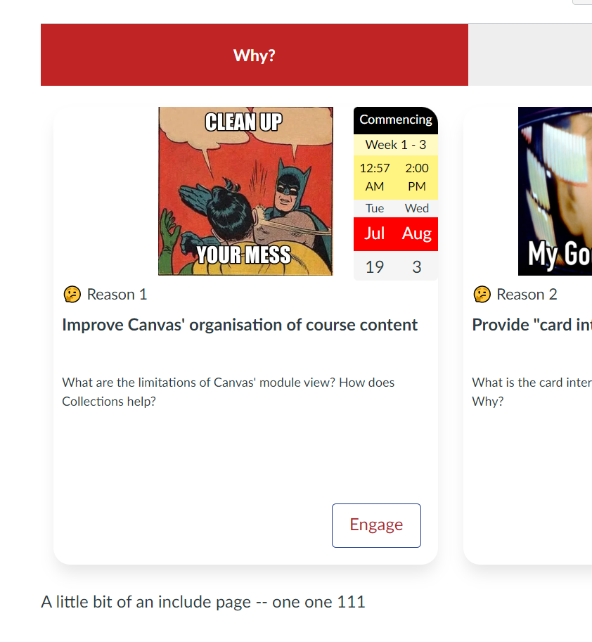
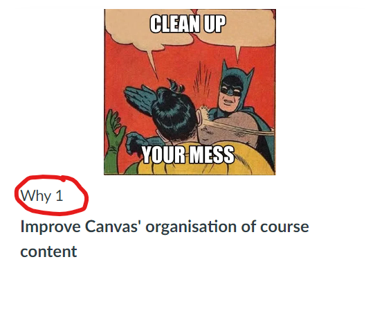
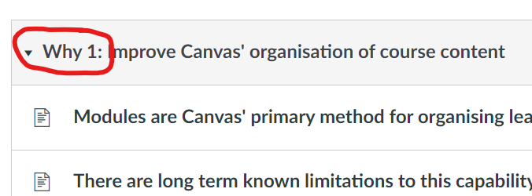

# Collections 

Collections are a core feature of Canvas Collections. Collections provide a way to organise modules into design and context specific groups of modules - a [feature long requested] by the Canvas Community.

Collections allows you to

- [Add a new collection](#add-a-new-collection.md) by specifying the name and representation.
- Manage [existing collections](#manage-existing-collections.md) in a variety of ways.

## Add a new collection

To add a new collection you set two initial properties for the collection

  

## Existing Collections

This list of already existing collections allows you to 

- Change the order of the collections
- Delete a collection
- Specify a collection as the _default collection_
- Change a collection's 

    * representation 
    * include page
    * output page

### Default collection

Specifies which collection you will see the very first time you (using your current web browser) view a modules page with Collections. 

After your first view, your web browser will remember the last collection you viewed and display that when you return to the same modules page with the same web browser.

### Hide a collection

Configure a collection so that students will not be able to see it.

### Add unallocated

Canvas modules can belong (be allocated to) a collection or not. By default, when viewing a collection you will only see the modules that belong to that collection. If you turn _Add unallocated_ on, then you will also see any modules that are not allocated to any collection.

### Output page

Specify the name of an **existing** page in the Canvas course site, when the _Update_ button is hit the page will be updated with a [Claytons version](../representations/claytons/overview.md) of the collection's current representation. 

### Include page

Specify the name of an **existing** page in the Canvas course site. When the collection is viewed, the contents of the page will be included before or after the collection's representation.

| Element | Before | After |
| --- | --- | --- | 
| Placement | Before | After |
| Configuration |      |    |
| Page |  |   |
| Collections |   |     |

### Apply module labels

> 🚧🧪☠️ **Warning:** This feature is experimental, under construction, and potentially destructive. Only use as suggested and if you're certain.

Each module can be allocated a label and a label "number" - see [the Objects reference for more](../objects/overview.md). A label identifies a module as a certain type of object, for example _Lecture_, _Workshop_, _Week_ etc. A label "number" provides a way to indicate a sequence of objects of a certain type, for example _Lecture 1_, _Lecture 2_, _Lecture 3_ etc.

To improve way finding, it makes sense to use labels and label numbers in two places:

1. The representation of the module provided by Collections; and,
2. The name of the module used by Canvas.

However, as shown in the following table, doing this requires updating information in two separate places. With multiple modules this may become a tedious and error-prone process.

| Place | End Result | Specification|
| --- | --- | --- |
| Collections' Representation |    |     |
| Canvas |    |    |

**Apply module labels** is intended to semi-automate this process. It will (🚧**not quite yet**🚧) provide a way to automatically modify Canvas module names to include the relevant Collections' label and label number.

For example, the following image shows a Canvas module view with three collections. The current collection _Why?_ contains two modules.  These modules have been allocated the label _Why_ and are using Collection's auto-numbering. However, the module names do not include the label or label number.

  

Fixing this could be done by manually editing the module names. Alternatively, the **Apply module labels** feature could be used to automatically update the module names. As shown in the following image, the process is

1. Open the _Collections Configuration_ dialog.
2. Click the _Apply module label_ button for the relevant collection.
3. Step through the alerts as Collections updates progress.
4. Reload the module page to observed the modified module names (this step is likely to disappear in future)

