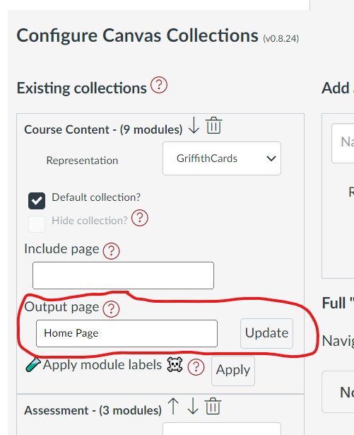

# Update a single collection's output page ("claytons")

## How to

### Specify an _output page_

Each collection's area in [the _Existing Collections_ area](../../collections/overview#existing-collections) of the Collections configuration area has an _output page_ text box (see following image).  Enter the name of an existing page in the text box. The "name" of the page is "Page Title" you will see when you edit the page. 

In the following image the _Course Content_ collection has been configured with an _output page_ with the name _Home Page_.

  

### Update a "single" collection 

In the image above there is an _Update_ button next to the _output page_ name. Clicking this button will update the _output page_ with the current content of that collection.  

The following animated image demonstrates the process, including these steps:

1. Show the existing Canvas page with some content already in it.
2. Open up the Collections configuration area and find the _output page_ for the _Why?_ collection.
3. Click the _update_ button and observe the alert generated informing of the updates successful completion.
4. Going back to the Canvas page and reloading it to see that the _Why?_ collection's representation has been added to the bottom of the page.

