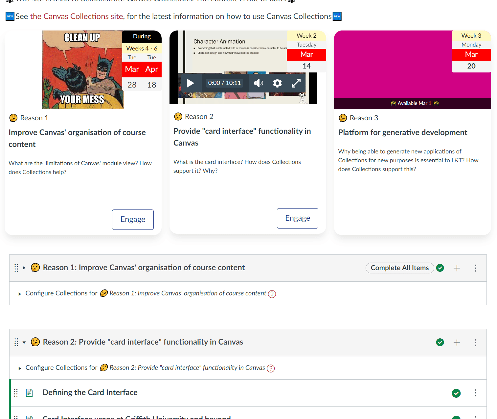
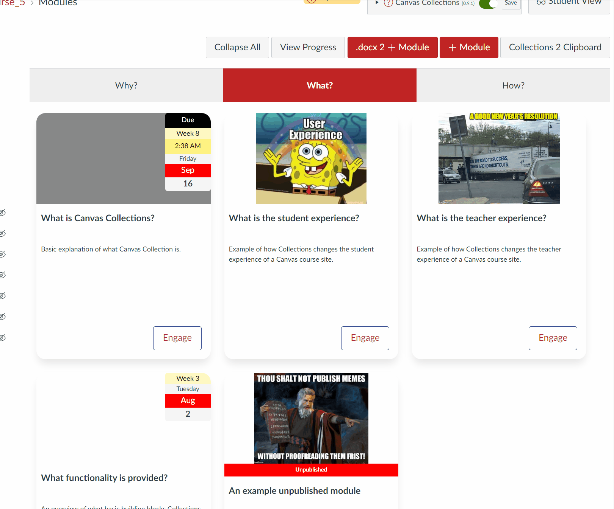
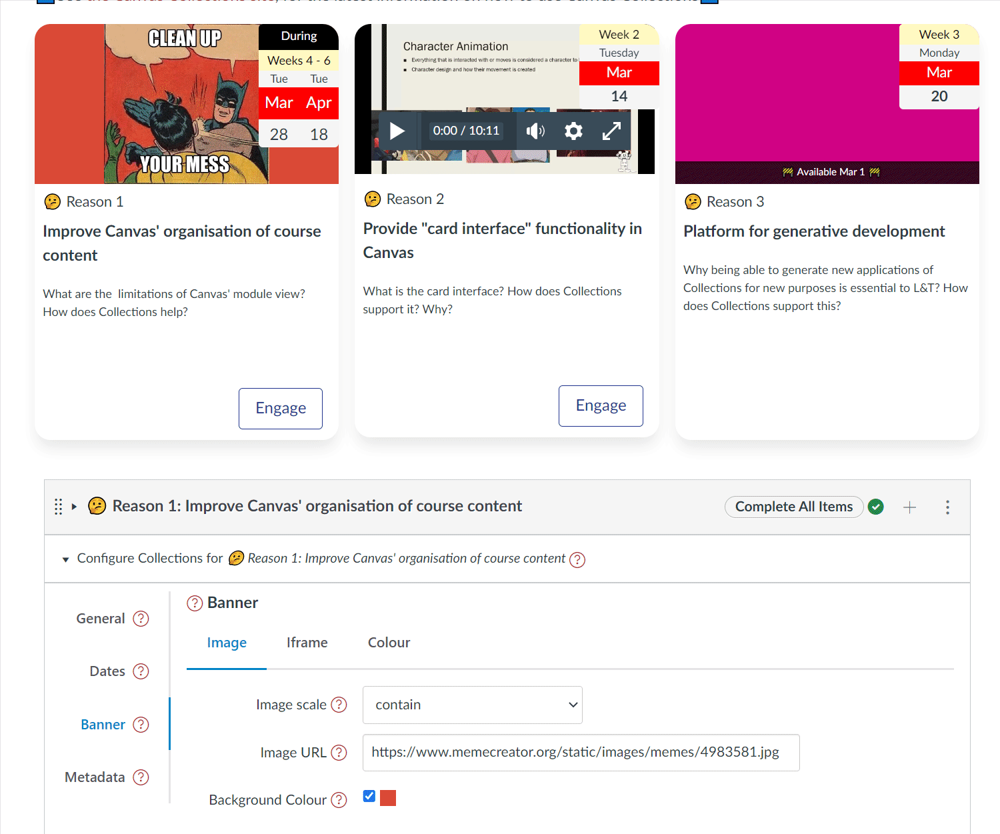

## Banner

The card design for Collection's cards representation uses the idea of a banner as the top part of the card (i.e. the top section of the card circled in red in the following image). Typically used to provide a visual representation of the module, contributing to the overall visual design of the course, and possibly helping students build conceptual associations. 

As illustrated in the following image, there are three common types of banner:

1. Image - the URL of an image is provided and is displayed in the banner.

    By default, the banner is set to a default image.
2. Iframe - an iframe (aka HTML embed code) - e.g. a YouTube embed.

    (The second card in the image below has a YouTube video banner which is currently not displaying)
3. Colour - the banner background is set to a single colour.

  

### Configuring the banner

You are able to configure 0 or more of the banner options. By default, a new module will be configured to use a placeholder image. The banner option that is current visible in the module configuration area will be the option used on the matching card - as illustrated in the following animated image.

!!! note "Some representations ignore the banner options"

    Currently, on the _Griffith Cards_ representation actively uses the banner options.

The following animated image steps through the following:

1. Showing a card representation of a module (using an iframe banner) and its corresponding configuration.
2. Illustrates how when the current banner choice is changed from image to iframe to colour how the card representation changes to match.





### Image

Images are specified by two pieces of metadata:

1. Image url - the web location where the image can be viewed.
2. Image scale - how the image should be scaled to fit within the available space.

#### Image url

Designed to contain either:

1. The URL for an image to be displayed.

    See the [Image URL](../../../walk-throughs/new/configure-modules/#image-url) section of the [Configure Modules walk-through](../../../walk-throughs/new/configure-modules) for more information, including demonstration of how to get the URL of an image in the Canvas files area.

2. The embed code for [an iframe](https://www.hostinger.com/tutorials/what-is-iframe/) (e.g. a YouTube/Vimeo/Stream/Studio etc video)

    Copy and paste the full embed code from a video-hosting (or some other) service and it will be embedded where the image would normally appear.

#### Image scale

For an iframe, _Image Scale_ is ignored. Instead, iframes are automatically set to use ```width="100%" height="100%"``` to ensure they are scaled to fit the available space.

For an image, _Image scale_ modifies the scaling of the image using the standard [CSS property called object-fit](https://www.w3schools.com/cssref/css3_pr_object-fit.asp). The following table outlines the possible values for object-fit. These values appear in the Image scale drop down when configuring a module. 

See the [Image Scale](../../../walk-throughs/new/configure-modules/#image-scale) section of the [Configure Modules walk-through](../../../walk-throughs/new/configure-modules) for more information, including an animation of the impact of the different values.


| Value | 	Description |
| --- | --- |
| cover |	The image is scaled to fit the available space, maintaining the aspect ratio. The image is cropped to fit the available space. |
| contain | 	The image is scaled to fit the available space, maintaining the aspect ratio. The image is not cropped. |
| fill |	The image is scaled to fill the available space, maintaining the aspect ratio. The image is cropped to fit the available space. |
| fit |	The image is scaled to fit the available space, maintaining the aspect ratio. The image is not cropped. |
| none |	The image is not scaled. |
| scale-down | 	The image is scaled to fit the available space, maintaining the aspect ratio. The image is not cropped. |

### Iframe

The iframe banner option allows you to copy and paste a [HTML iframe element](https://developer.mozilla.org/en-US/docs/Web/HTML/Element/iframe). Meaning you're able to embed other web content such as another web page, but more commonly a video (e.g. from YouTube or Studio). Collections will perform some checks on the iframe code and will modify it to work within the context of a card.

The following animated image demonstrates the process of using the iframe banner option. Before starting, a [public embed code (aka iframe) for a Canvas Studio video](https://community.canvaslms.com/t5/Studio/How-do-I-get-a-public-link-or-embed-code-for-media-in-Canvas/ta-p/1712) was created and then copied into the clipboard. The image shows the process from there, including:

1. Moving to the Module's configuration area.
2. Opening the _banner_ section and moving to the _iframe_ option.
3. Pasting the video iframe code into the available text area and resizing the text area to better see the code.
4. Reading the alert box Collections generates when it detects a change in the iframe code.
5. A return to the module to view the video and press play.



### Colour

The colour banner option allows you to choose a fixed colour for the banner. This has proven useful in situations where a module represents a topic/purposes for which no photo or video is available or suitable. The colour is chosen using a colour picker - as demonstrated in the following animated image.



