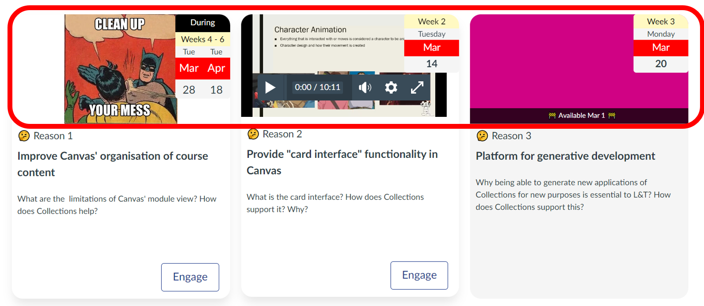

## Banner tab - the module configuration area

The _banner tab_ is one of four tabs that form the [_module configuration area_](overview.md). It provides the interface to configure a banner (image, iframe, or colour) associated with a specific module (see below).

!!! warning "The _banner_ option only applies to one (some) representations"

    How an object is represented is the responsibility of the chosen [_representation_](../representations/overview.md). Currently, only the _Griffith Cards_ representation uses the banner options.

Collection's cards representation uses the idea of a banner as the top section of the card (circled in red in the following image). It is used provide an additional visual representation of the module with the intent to enhance

1. the visual design of the course; and,
2. student learning (see [dual-coding theory](https://en.wikipedia.org/wiki/Dual-coding_theory)).

<figure markdown>
<figcaption>Card representation with the <em>banner</em> section highlighted</figcaption>
  
</figure>

### Three types of banner

As illustrated in the image above, there are three common types of banner:

1. Image - the URL of an image is provided and is displayed in the banner.

    The first image above uses an image to reinforce the primary purpose of Collections.

2. Iframe - a [HTML iframe element](https://developer.mozilla.org/en-US/docs/Web/HTML/Element/iframe) used to embed another web page

    The second card above shows an embedded Canvas Studio video.

4. Colour - the banner background is set to a single colour.

    The last card above has a plain colour background.

### Choosing the banner type

The Collections' module configuration area includes a _banner_ tab. This allows you to 

1. Choose the type of banner to use; and,
2. Configure the chosen banner.

The following animated image demonstrates where to find the _banner_ tab and how which ever _banner_ option you've chosen last, is the option used by the representation.

<figure markdown>
<figcaption>Switching between different types of banner</figcaption>
  <sl-animated-image src="../pics/animatedBannerChanges.gif" />
</figure>

### Configuring the chosen banner type
#### Image

Images are specified by two pieces of metadata:

1. Image url - the web location where the image can be viewed.
2. Image scale - how the image should be scaled to fit within the available space.

##### Image url

Specifies the location (Universal Resource Locator - URL) for an image to display in the banner. The URL can be to an image stored in Canvas files, or to an image stored on another web site. The only constraint is that all visitors to the course site are able to access the image.

!!! note "Using an image in your course's files area"

    Rather than rely on external images, you can [use an image in your course's files area](./url-canvas-files-image.md) by generating a URL. 

    Note: The [Canvas Collections course copy process](../lifecyle/course-copy/overview.md) will update these URLs if you copy content to a new Canvas course site.

!!! warning "Use of the placeholder image"

    If the _image_ banner type is chosen and no _image url_ is specified, a placeholder image is used. 

<figure markdown>
<figcaption>The placeholder image</figcaption>
  
</figure>

##### Image scale

It is likely that your chosen image does not have the same [aspect ratio](https://en.wikipedia.org/wiki/Aspect_ratio_(image)) as the banner section of the card. This is especially true given that the size of the banner section is not fixed. It is responsive to the size of the browser window and the configuration of the Cards representation.

_Image scale_ is used to inform the browser how to scale your image to fit the available space.  _Image scale_ modifies the scaling of the image using the standard [CSS property called object-fit](https://www.w3schools.com/cssref/css3_pr_object-fit.asp). The following table outlines the possible values for object-fit. These values appear in the Image scale drop down when configuring a module. 

| Value | 	Description |
| --- | --- |
| cover |	The image is scaled to fit the available space, maintaining the aspect ratio. The image is cropped to fit the available space. |
| contain | 	The image is scaled to fit the available space, maintaining the aspect ratio. The image is not cropped. |
| fill |	The image is scaled to fill the available space, maintaining the aspect ratio. The image is cropped to fit the available space. |
| fit |	The image is scaled to fit the available space, maintaining the aspect ratio. The image is not cropped. |
| none |	The image is not scaled. |
| scale-down | 	The image is scaled to fit the available space, maintaining the aspect ratio. The image is not cropped. |

<figure markdown>
<figcaption>Experimenting with image scale values</figcaption>
  <sl-animated-image src="../pics/animatedImageScale.gif" alt="Experimenting with image scale values" />
</figure>

##### (Image) Background Colour

When using an image banner it can be useful to change the background of the banner from the default white. If selected, the _Background Colour_ option will use the colour specified by the [_Colour_ feature (see below)](#colour) as the colour in the background of your image.

<figure markdown>
<figcaption>Changing the image background colour</figcaption>
  <sl-animated-image src="../pics/animatedImageBackgroundColour.gif" alt="Changing the image background colour" />
</figure>

#### Iframe

The _iframe_ banner type allows you to embed another web page into the banner section using the [HTML iframe element](https://developer.mozilla.org/en-US/docs/Web/HTML/Element/iframe). Most useful for embedding video (e.g. from YouTube or Studio).

!!! note "Collections will check and modify the iframe code"

    Collections will perform some checks on the iframe code, including attempting to ensure the iframe will fit within the banner section. 
    
    You will be given a choice to check the modifications before proceedig.

<figure markdown>
<figcaption>Using the iframe banner type to embed a YouTube video</figcaption>
  <sl-animated-image src="../pics/iframeAnimated.gif" alt="Using the iframe banner type to embed a YouTube video" />
</figure>

#### Colour

The _colour_ banner type enables the use of a fixed colour for the banner. Useful in situations where a module represents a topic/purposes for which no photo or video is available or suitable. The colour is chosen using a colour component that allows you to specify the colour in numerous different ways.

<figure markdown>
<figcaption>Selecting a banner colour</figcaption>
  <sl-animated-image src="../pics/colourPickerAnimated.gif" alt="Selecting a banner colour" />
</figure>
