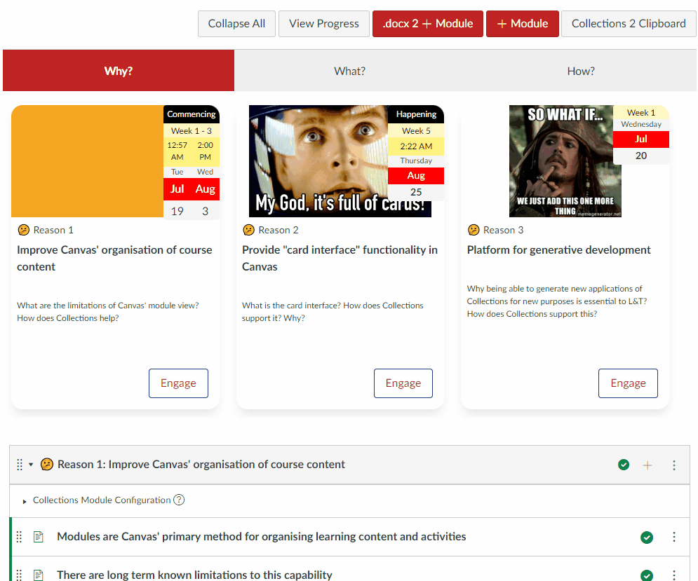

## Dates

Collections allows you to specify the date, time, or date/time range. In a University context, such dates are typically given with reference to a given study period (aka semester, trimester, study session etc.). For example, Monday Week 1 of Trimester 1 will be a different date for Monday Week 1 of Trimester 2.

This commonly leads to two strategies:

1. Generic dates - specify the date in a study period independent way (e.g. "Week 1", "Week 2", "Week 3" etc.). No upkeep is required, but students are expected to translate the generic dates into specific calendar dates.
2. Specific dates - specify the actual calendar date (e.g. 1st March). Requires manual updating each study period, but students can easily see the specific date.

Collections can take on the task of translating generic dates into calendar specific dates. It identifies the study period for the current course site and translates a generic date into the appropriate specific date based on the institution's academic calendar.

!!! Note "Dates is workable, but under construction"

    :construction: Currently, dates can only be specified using generic dates and Griffith University study periods.

### Study Period

At Griffith University, the course code typically includes a term code. A four digital number identifying the study (aka teaching) period.  Collections attempts to extract the term code from the course code, which is then used to map generic dates to specific calendar dates. If the term code cannot be extracted, Collections defaults to the current study period.

See [the Griffith course id explanation page](https://intranet.secure.griffith.edu.au/computing/using-learning-at-griffith/staff/administration/course-ID) for more information about term codes.

Collections will display the label - circled in red in the following image - for the study period it is using to generate calendar dates.

  

### Date types

As summarised in the following table, the date area of the Module configuration dialog allows you to specify dates for three different purposes.

| Date type | Purpose |
| --- | --- |
| Start Date | Either a one-off date or the start date of a date range |
| Stop Date | The end date of a date range |

All three date types are available from the same space via a tabbed interface. As illustrated by the following animated image, each date type provides a similar (but not the same) interface.

### Start Date

Start date can specify either a one-off date or the start of a date range. The following table summarises the values you can specify for a start date.

| Value | Default value | Description |
| --- | --- | --- |
| Date label | Commencing | A text label that will be added before the date (range). e.g. "Starts" or "Due".
| Day of week | _Not Chosen_ | The full name of the day of the week for the date |
| Week | _Not Chosen_ | The number of the week within the study period in which the date occurs. |
| Time | | The time of day (if any) for the date. |

### Stop Date

Stop date specifies the final date in a date range. A stop date can be assigned all of the same values as a Start date (see previous table), except for the Date label.

### Calculated Date

:construction: add detail about this

### Representation of dates

How dates are displayed to the student depends on the combination of:

1. The design of the current representation for a collection.
2. What dates have been configured.

The following animated image demonstrates how the representation of a date changes through the following stages:

1. No date has been configured for the cards representation.
2. A start date is partially and then fully configured.
3. The representation is changed to the assessment table representation and then back to the cards.
4. A stop date is partially and then almost fully configured (the week is not specified, hence no final date).

