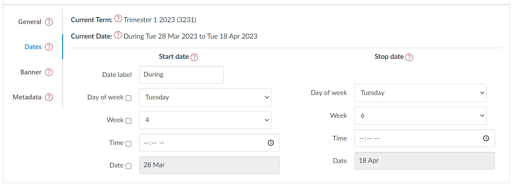
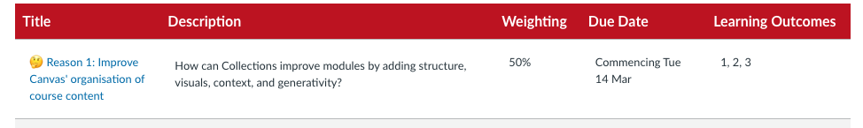

# Dates tab - module configuration element

## Background

The _dates tab_ is one of four tabs that form the [_module configuration area_](overview.md). It provides the interface to configure various date [related properties](#properties) to define a single date (just the _start date_) or a date range (from _start date_ to _stop date_) for each module. Different

<figure markdown>
<figcaption>The "dates tab" of the module configuration area</figcaption>

</figure>

## Properties

<link rel="stylesheet" href="https://cdn.jsdelivr.net/npm/@shoelace-style/shoelace@2.0.0/dist/themes/light.css" />

As shown above the _dates tab_ consists of four main components summarised in the following table.

| Components | Description |
| --- | --- |
| Date label | A text label that will be added before the date (range). e.g. "Starts" or "Due". |
| Start Date | A collection of properties that can be used to specify a date or the start of a date range. |
| Stop Date | A collection of properties that can be used to specify the end of a date range. |
| Date output | A human readable description of the current date. Using the date representation from [the GriffithCards representation](../representations/overview.md#griffithcards). |

### Date label

The _date label_ is intended as a short text label that will normally precede the rest of the date. For example, the image above is using _Commencing_ as the date label.

!!! note "No HTML in the date label"

    HTML tags included in the date label will appears as text. Will <strong>note</strong> change the appearance.

### Start and stop date

The _Start_ and _Stop_ dates are used to define the time and date components. There are three common combinations of _start_ and _stop_ dates:

1. Neither _start_ nor _stop_ dates defined - no date appears in any representation.
2. Just the _start_ date is defined - a single date appears.
3. Both _start_ and _stop_ dates defined - a date range appears.

The date/time properties available for both _start_ and _stop_ dates are summarised in the following table. Only two of these properties can be selected by you.

| Property | Description |
| --- | --- |
| Select date | Used to select which calendar date applies for this date |
| Select Time | (optionally) select the time of date for the date |
| Day | Automatically calculated based on the selected calendar date. Provided to enable inclusion in the _date output_ |
| Date | Automatically calculated based on the selected calendar date. Provided to enable inclusion in the _date output_ |
| Month | Automatically calculated based on the selected calendar date. Provided to enable inclusion in the _date output_ |

#### Visibility

For a selected date, each of the following components can be hidden by turning off the related visibility checkbox.

| Property | Description |
| --- | --- |
| Time | Whether or not the time is shown |
| Day | Whether the day of the week for the chosen date is shown |
| Date | Whether the numeric date of the month for the chosen date is shown |
| Month | Whether the abbreviated month name for the chosen date is shown |

### Date output

The final component of the _dates_ tab is the _date output_. It provides a representation of the module's configured date/time (range) using the GriffithCards date representation. Provided to give immediate feedback on the current date configuration.

## Example - navigate

What visitors to a course site see in terms of dates depends on a combination of:

1. how they data properties have been configured; and
2. what representation is being used.

For example, the following two figures demonstrate the appearance of the date configuration in the figure at the top of this page using the two most common representations.

### GriffithCards representation

The _GriffithCards_ representation uses a very "card" specific representation of dates. But one that is broadly task independent.

<figure markdown>
<figcaption>GriffithCards representation of a start date</figcaption>

</figure>

### AssessmentTable representation

The _AssessmentTable_ representation is designed for a more specific and less visual purpose.

<figure markdown>
<figcaption>AssessmentTable representation of the same start date</figcaption>

</figure>

## Example - configure

The following animated image shows how to use the _date tab_ and the different ways dates can be displayed.

<figure markdown>
<figcaption>Animated demonstration of changing dates</figcaption>
<sl-animated-image src="../pics/configureDatesAnimated.gif" alt="Animated demonstration of changing dates" />
</figure>
