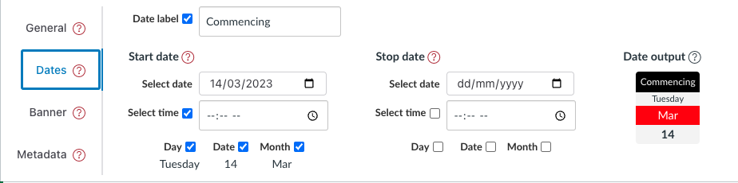

# Dates tab - module configuration element

The _dates tab_ is one of four tabs that form the [_module configuration area_](overview.md). It provides the interface to configure a date or date period for a specific module (see below).

<figure markdown>
<figcaption>The "dates tab" of the module configuration area</figcaption>

</figure>

## About dates in Canvas Collections

In a University context, dates are typically given with reference to a given study period (aka semester, trimester, study session etc.). For example, Monday Week 1 of Trimester 1 will be a different date for Monday Week 1 of Trimester 2.

This commonly leads to two strategies:

1. Use generic dates - specify the date in a study period independent way (e.g. "Week 1", "Week 2", "Week 3" etc.). 

    No upkeep is required, but students are expected to translate the generic dates into specific calendar dates.

2. Use specific dates - specify the actual calendar date (e.g. 1st March). 

    Each time you reuse a course site for a different study period, you need to manually update the dates to ensure correctness.

Collections can take on the task of translating generic dates into calendar specific dates. It identifies the study period for the current course site and translates a generic date into the appropriate specific date based on the institution's academic calendar.

!!! Note "Dates is workable, but under construction"

    :construction: Currently, dates can only be specified using generic dates and Griffith University study periods.

## Properties

<link rel="stylesheet" href="https://cdn.jsdelivr.net/npm/@shoelace-style/shoelace@2.0.0/dist/themes/light.css" />

The _dates tab_ allows you to view and modify the following properties.

| Property | Description |
| --- | --- |
| [Current Term](#study-period) (or Study Period) | The institution specific term that Collections has identified from the course site. |
| Current Date | A human readable description of the date currently set by the _dates tab_. |
| Start Date | A collection of properties that can be used to specify a date or the start of a date range. |
| Stop Date | A collection of properties that can be used to specify the end of a date range. |
| Date label | A text label that will be added before the date (range). e.g. "Starts" or "Due". |
| Day of week | Drop down menu to select the name day of the week for the date. |
| Week | Drop down menu to select the number of the week within the study period in which the date occurs. |
| Time | Time of day (if any) for the date. |
| Date | A read only text book that displays the current date as specified by the specific data component |

### Study Period

The _Study Period_ or _Current Term_ property displays Collections' current calculation of the appropriate study period/term for the current Canvas site. This is calculated in an institutional specific way.

The chosen _current term_ is used to access the institutional calendar. This is then used to calculate specific calendar dates for generate dates (e.g. "Tuesday, Week 4" becomes "28th March, 2023")

<figure markdown>
<figcaption>Example calculated "current term"</figcaption>
  
</figure>

### Current date

The _dates tab_ will display the current date. This is calculated by a combination of 

1. the [current study period/term](#study-period); and,
2. the configuration of the [start date](#start-date) and [stop date](#stop-date) properties.

<figure markdown>
<figcaption>Example calculated "current date"</figcaption>

</figure>

### Start date
### Stop date

The _date tab_ allows you to combine start and stop dates to specify either:

1. A single date (just the _start date_ defined); or
2. A date range (both the _start_ and _stop_ date defined).

Both the _start_ and _stop_ date are specified using the same combination of properties.

| Property | Description |
| --- | --- |
| Date label | A text label that will be added before the date (range). e.g. "Starts" or "Due". |
| Day of week | Drop down menu to select the name day of the week for the date. |
| Week | Drop down menu to select the number of the week within the study period in which the date occurs. |
| Time | Time of day (if any) for the date. |
| Date | A read only text book that displays the current date as specified by the specific data component |

!!! note "Choosing a _week_ is the minimum required for a date to be considered configured"

    i.e. once _start_ date has a week chosen, calculation of current date will commence.  

### Calculated Date

:construction: add detail about this

### Representation of dates

How dates are displayed to the student depends on the combination of:

1. The design of the current representation for a collection.
2. What dates have been configured.

The following animated image demonstrates how the representation of a date changes through the following stages:

1. No date has been configured for the cards representation.
2. A start date is partially and then fully configured.
3. The representation is changed to the assessment table representation and then back to the cards.
4. A stop date is partially and then almost fully configured (the week is not specified, hence no final date).

