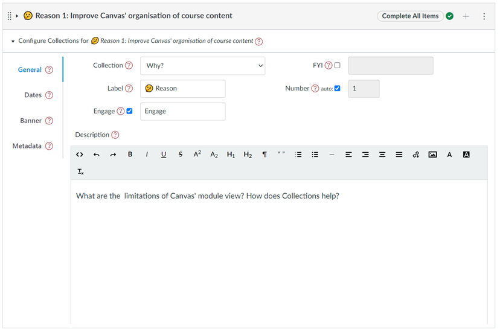

# General tab - module configuration element

The _general tab_ is one of four tabs that form the [_module configuration area_](overview.md). It provides the interface to configure the general properties for a specific module (see below).

<figure markdown>
<figcaption>The "general tab" of the module configuration area</figcaption>

</figure>

## Properties

| Metadata | Description |
| --- | --- |
| [Collection](#collection) | 
Specify which, if any, of the existing collections this module is allocated to.
 |
| [FYI Objects](#fyi-objects) | 
Specify whether a module is intended as a "for your information" object. That is, an object for which students can see information about the module, but not the module itself.
 
 Useful if you want students to see details about a module that hasn't yet been released to them.
 |
| [Label](#label) & [Numbers](#label-and-numbers) | 
Explicitly identify (label) a module as a particular object and its position in the collection (the number - which can be auto calculated). For example, <em>Lecture 5</em> or <em>Assessment item 3</em>
 | 
| [Engage](#engage) | 
Specify if and what text should appear in the module's button when using the Cards representation. 
|
| [Description](#description) | 
Some HTML intended to provide a description or rationale for the object represented by the module. To help students understand the purpose, rationale or other aspect of the module.
 |

### Collection

Typically, each module is allocated to one of [the existing collections](../collections/existing-collections.md) for the course. The _general tab_ provides a drop-down menu of the existing collections. You change the allocated collection by selecting a different collection from the drop-down menu.

!!! note "Unallocated modules will not be visible to students, unless a collection has been [configured to include unallocated modules](../collections/existing-collections.md#add-unallocated)."

The following animated image demonstrates how to change the collection for a module and the impact of that change on the Collections' view.

<figure markdown>
<figcaption>Changing the collection for a module</figcaption>
<sl-animated-image src="../pics/animatedChangeCollection.gif" alt="Changing the collection for a module" />
</figure>

### FYI objects

Normally, Collections' provides a representation of modules that have been published to students. Clicking on the representation will take the student to the Canvas module. There may be times when you wish to provide information about the module (the representation), but not access to the module (e.g. it's unpublished). In this case, you can configure the module as a _For Your Information_ (FYI) object.

Selecting the _FYI_ switch on the _general tab_ turns a module into a _For Your Information_ (FYI) object, this means that any representation of the module will:

1. Always appear regardless of whether the visitor has access (e.g. the module is unpublished); 
2. Never include any Canvas information about the module (e.g. a link to the module, whether the module is published or unpublished etc.)
3. Only display information about the module configured by Collections (e.g. the banner, the dates, description, label etc.).

!!! Note "FYI objects and other representations"

    The example below focuses on [the _GriffithCards_ representation](../../representations/overview/#griffithcards). All other representations should provide similar support for FYI objects, customised to fit the specifics of the representation.

The following tabs provide more detail about and examples of using FYI objects.

=== "Common applications of FYI objects"

    | Application | Description |
    | ------- | --------- |
    | "Coming soon" modules | Allow students to see information about a module that they can't currently access. Helping them understand the complete structure of the course without being able to access the content. |
    | "Simple information sharing" | You have important information to share and want it integrated into the collection's representation, including use of Collection's other features (e.g. banner, dates, etc). But don't need all the additional features of a module (e.g. items)  |

=== "FYI Example"

    The following animated image demonstrates how an FYI object can be used with the following steps: 

    1. Demonstrate that unpublished modules are not displayed for students.  
    2. Modify the unpublished module to make it an FYI object.  

        Note how the _Engage_ button disappears after this change. FYI object's can't link to the module.

    3. Add some an FYI message.

        A short textual message is added. This is overlaid on the bottom of the banner. Useful for displaying some additional information for the students.

    4. Demonstrate how FYI objects are displayed for students.

        Even though the associated Canvas module is still unpublished, the FYI object is displayed in student view. **Note:** The module itself remains invisible to students. All they can see is the FYI object containing information you've configured using Collections.
     
    5. Demonstrate the FYI objects don't need a message

    <figure markdown>
    <figcaption>Example of creating an FYI object (unpublished module)</figcaption>
    <sl-animated-image src="../pics/animatedFYIObject.gif" alt="Example of creating an FYI object (unpublished module)" />
    </figure>

### Label 

The label helps identify a Canvas module as a specific type of object (e.g. _Lecture_, _Workshop_, _Assignment_). It helps them visitors develop a conceptual understanding of why, what, and how to engage with the module/object.

### Label and numbers

Often a collection will have multiple modules all representing different objects of the same type (e.g. multiple lectures, or weeks). In this case, it's useful to be able to number the objects of the same type (e.g. _Lecture 1_, _Lecture 2_ etc).

The _general tab_ provides space for you to specify a _label_ and a _number_ for each module.

A label is any sequence of characters (including emojis).

There are two options for the number: 

1. _Auto-number_ - the number is automatically calculated based on the order of the modules in the collection. The first lecture will be _Lecture 1_ the second _Lecture 2_ and so on.   
2. _User specified_ - i.e. you can manually specify any sequence of characters, including emojis, or leave it blank.

Depending on the representation you've chosen for a collection, the _label_ and _number_ might be used to:

1. Display the label and number in the module's representation.
2. Modify the module name as shown by the representation (i.e. it may remove the label and number from the module name).

<figure markdown>
<figcaption>Adding a label and number to three modules</figcaption>
<sl-animated-image src="../pics/addLabel.gif" alt="Adding a label and number to three modules" />
</figure>

### Engage

Card representations can include an _Engage_ button as an explicit affordance for the visitor to click on the card and thereby access the module. 

The _general tab_ allows you to configure the _Engage_ button by:

1. Turning the button on or off.

    Even if the _Engage_ button is turned off, the visitor can still click on a normal card to access the module. (unless it is an FYI object for which the _Engage_ button is always off).

2. Changing the button text.

The following animated image demonstrates the process of configuring the _Engage_ button, including: turning off the _Engage_ button; turning it back on again; changing the label; and, finally returning back to the default.

!!! note "FYI Objects (as shown above) don't have an _Engage_ button"

<figure markdown>
<figcaption>Example of changing the "Engage" button for a module</figcaption>
<sl-animated-image src="../pics/animatedEngage.gif" alt="Example of changing the 'Engage' button for a module" />
</figure>

### Description

The description is best used to provide students with additional information about what, why and how they might engage with the activities and information contained by a module. The description is a relative short piece of text entered using a simple visual editor under the description heading of the module configuration area.

<figure markdown>
<figcaption>Adding a description to a couple of modules</figcaption>
<sl-animated-image src="../pics/addDescription.gif" alt="Adding a description" />
</figure>

