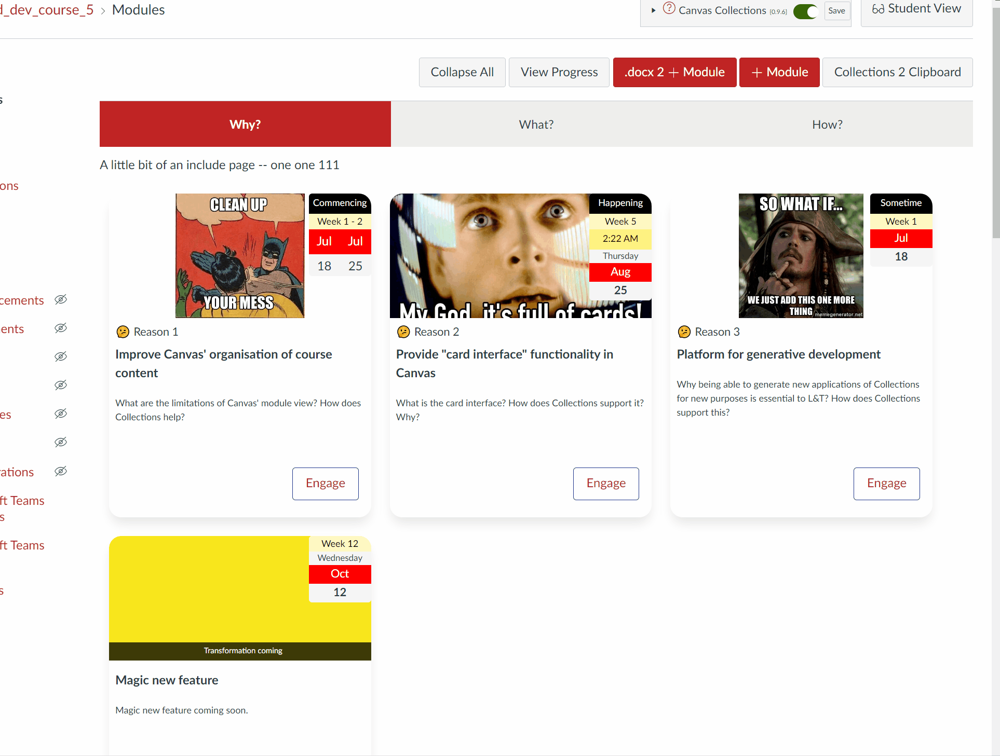

## Description

A description of the object that will be displayed in most representations to provide students with a way to answer what, why, how or some other question about the module. How (and perhaps if) the description is shown to the student will depend on the relevant collection's representation.

## FYI

A way to specify that a module should become a _For Your Information_ (FYI) only object. i.e. any representation will only display Collections' information (label, number, description, banner etc). It should not display any information about the actual Canvas module, including a link to the module.

FYI object's - since they don't display any information about the Canvas module - are always displayed. Regardless of whether the module is unpublished or generally not available to the student.

## Labels and Numbers

Many course designs use modules to represent common objects (e.g. lectures, tutorials, workshops, assessments, themes, topics etc.). Often a course will have multiple such objects (e.g. topic 1, topic 2, topic 3). Labels and numbers provide a means to explicitly identify such objects and their sequence. This information is used in different ways by each representation.

Collections provides the ability for you to explicitly specify the number for each module OR it can auto calculate the number based on the module's position in the collection.

## Engage Button

Card representations can include an _Engage_ button as an explicit affordance for the visitor to click on the card. When configuring the _Engage_ button you can choose to:

1. Turn the button on or off.

    Even if the _Engage_ button is turned off, the visitor can still click on a normal card to access the module. (unless it is an FYI object for which the _Engage_ button is always off).

2. Change the button text.

The following animated image demonstrates the process of configuring the _Engage_ button, including: turning off the _Engage_ button; turning it back on again; changing the label; and, finally returning back to the default.

## FYI Objects

Selecting the _FYI_ switch turns a module into a _For Your Information_ (FYI) object, this means that any representation of the module will:

1. Always appear regardless of whether the visitor has access (e.g. the module is unpublished); 
2. Never include any Canvas information about the module (e.g. a link to the module, whether the module is published or unpublished etc.)
3. Only display information about the module configured by Collections (e.g. the banner, the dates, description, label etc.).

There are two common uses for an FYI object:

1. "Coming soon" modules

    Allow students to see information about a module that they can't currently access. Helping them understand the complete structure of the course without being able to access the content.

2. Simple information sharing.

    You have important information to share and want it integrated into the collection's representation, including use of Collection's other features (e.g. banner, dates, etc). But don't need all the additional features of a module (e.g. items) 

!!! Note "FYI objects and other representations"

    The example below focuses on [the _GriffithCards_ representation](../../representations/overview/#griffithcards). All other representations should provide similar support for FYI objects, customised to fit the specifics of the representation.

### Example

The following animated image demonstrates how an FYI object can be used with the following steps:

1. Demonstrate that unpublished modules are not displayed for students.
2. Modify the unpublished module to make it an FYI object.

    Note how the _Engage_ button disappears after this change. FYI object's can't link to the module.

3. Add some an FYI message.

    A short textual message is added. This is overlaid on the bottom of the banner. Useful for displaying some additional information for the students.

4. Demonstrate how FYI objects are displayed for students.

    Even though the associated Canvas module is still unpublished, the FYI object is displayed in student view. **Note:** The module itself remains invisible to students. All they can see is the FYI object containing information you've configured using Collections.
     
5. Demonstrate the FYI objects don't need a message

