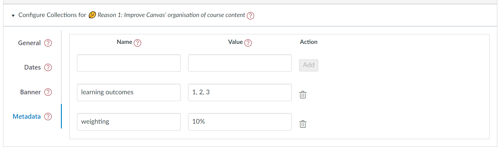

# Metadata tab - the module configuration area

The _metadata tab_ is one of four tabs that form the [_module configuration area_](overview.md). It provides the interface to add and modify ad hoc metadata variables (name and value) for a specific module (see below).

This additional metadata may be used for purposes beyond Canvas Collections. It may also be used by some representations (e.g. the _AssessmentTable_ representation looks for metadata variables by the names _learning outcomes_ and _weighting_)

<figure markdown>
<figcaption>An example metadata tab</figcaption>

</figure>

## Properties

The metadata tab manages a list of metadata variables. Each variable has a name and a value. 

!!! note "A metadata variable can only be added if it has both a _name_ and a _value"

## Name

The name of the metadata variable.

!!! warning "A variable name cannot include HTML tags and other special characters."

	Collections will remove these characters from the name and ask if you wish to proceed with the modified name.

## Value

The value of the metadata variable. An arbitrary string of text.

!!! note "A variable value can include HTML tags and some other special characters."

<figure markdown>
<figcaption>An animated example using the metadata tab to modify variables</figcaption>
<sl-animated-image src="../pics/animatedMetadataTab.gif" src="An animated example using the metadata tab to modify variables">
</figure>

<link rel="stylesheet" href="https://cdn.jsdelivr.net/npm/@shoelace-style/shoelace@2.0.0/dist/themes/light.css" />
