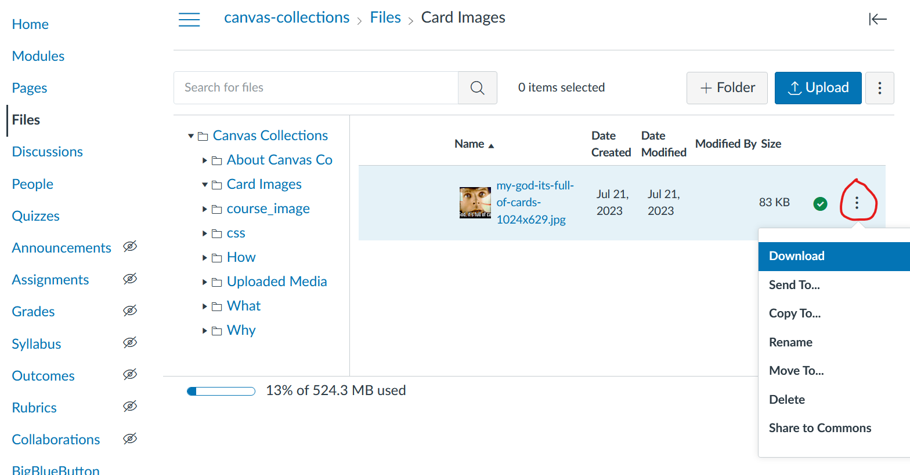
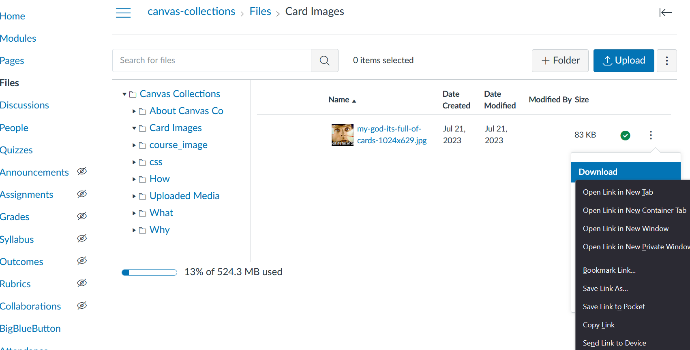
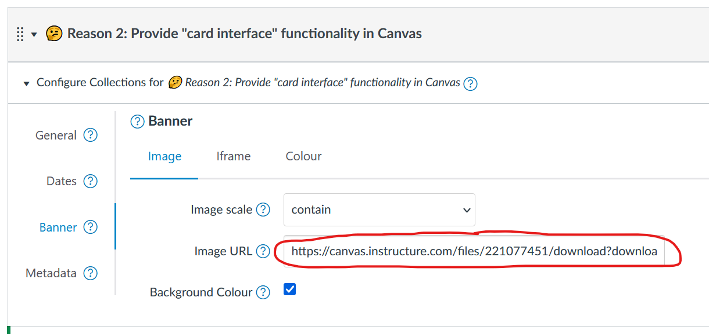

<!--
 Copyright (C) 2023 David Jones
 
 This file is part of Canvas Collections.
 
 Canvas Collections is free software: you can redistribute it and/or modify
 it under the terms of the GNU General Public License as published by
 the Free Software Foundation, either version 3 of the License, or
 (at your option) any later version.
 
 Canvas Collections is distributed in the hope that it will be useful,
 but WITHOUT ANY WARRANTY; without even the implied warranty of
 MERCHANTABILITY or FITNESS FOR A PARTICULAR PURPOSE.  See the
 GNU General Public License for more details.
 
 You should have received a copy of the GNU General Public License
 along with Canvas Collections.  If not, see <http://www.gnu.org/licenses/>.
-->

# Using a Canvas file image as a banner

The Canvas Collections [image banner](./banner.md#image) requires a URL to an image. This image can be hosted externally (e.g. on the open web), or it can be hosted in [the Canvas files area](https://community.canvaslms.com/t5/Instructor-Guide/How-do-I-use-Files-as-an-instructor/ta-p/929) of your Canvas course site.

Here's how to generate a URL for an image in your Canvas course site's files area.

## 1. Upload an image to your Canvas course site's files area

Use the Canvas community [instructions for uploading files](https://community.canvaslms.com/t5/Instructor-Guide/How-do-I-upload-a-file-to-a-course/ta-p/618) to upload the image.

!!! tip "Create a folder for all your Collections images"

    It can make organisation easier if you create a folder in your Canvas course site's files area to store all your Collections images.

## 2. Click on the "three dots" menu for the uploaded image

Once the image is uploaded, 

1. View the folder containing the image.
2. Hover your mouse over the specific image.
3. Click on the "three dots" menu that appears (see image below).

<figure markdown>

<figcaption>Clicking on the "three dots" menu for the uploaded image</figcaption>
</figure>

## 3. Copy the "download" URL for the image

Now you can obtain a download link for the image, by

1. Hover over the "download" option in the "three dots" menu (see image above).
2. Open your browser's contextual menu by [right or _ctrl_ clicking](https://support.apple.com/en-au/guide/mac-help/mh35853/mac)
3. Click on the "copy link" or equivalent option in the contextual menu.

This will copy the "download" URL for the image into your computer's clipboard.

<figure markdown>

<figcaption>Copying the image download URL</figcaption>
</figure>

## 4. Paste the "download" link into the banner image URL

With Collections' ["edit mode" turned on](../../lifecycle/editing/lifecycle.md):

1. Find the [module configuration element](../../../configure/configure-modules.md#1-find-the-module-configuration-element).
2. Open the [banner tab](./banner.md)
3. Paste the "download" link into the banner image URL (see image below).

<figure markdown>

<figcaption>Paste the "download" link into the banner image URL</figcaption>
</figure>
