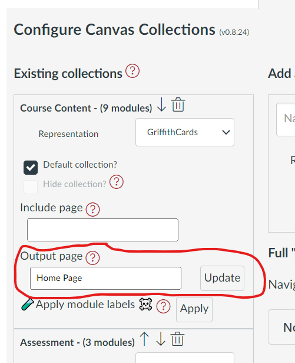

# "Claytons" Collections

## Why?

The standard "live" version of Canvas Collections requires that you have installed Collections (either [individually](../../../getting-started/install/individual.md) or [institutionally](../../../getting-started/install/institutional.md)). Otherwise the Canvas modules view will remain "vanilla". 

Institutional installation is a decision for your entire institution and requires work by your institution's information technology folk.

Individual installation requires each person (students and teachers) to install a userscript manager and the Collections userscript.

"Claytons" Collections is a way to have Collections without having to install it. 

## What?

"Claytons" Collections is the Collections you have when you're not having Collections (a play on [a marketing campaign for a drink](https://en.wikipedia.org/wiki/Claytons)). It's a way of one person install and using Collections to create normal Canvas pages that look like Collections, but can be viewed without Collections.

It is a way of semi-automating common advice from the Canvas community to manually create pages to workaround the limitations of Canvas' module view. Some examples of that advice, include: [create full navigation using pages](http://lisahistory.net/wordpress/2020/06/working-against-canvas-three-tips/), [create an inviting course home page](https://community.canvaslms.com/t5/Canvas-Instructional-Designer/Creating-an-inviting-course-home-page/ba-p/267236), and [home sweet home pages without tables](https://community.canvaslms.com/t5/Canvas-Instructional-Designer/Home-Sweet-Homepages-without-Tables/ba-p/275079).

## How does it work? 

There are two steps to using "Claytons" Collections:

1. Specify an  _output page_ for any collection to be included.

    You can use "Claytons" for one or more collection by specifying the name of an **existing** Canvas page within your course site.

2. Update the _output page_ for your collection.

    Any changes you make using Canvas Collections are **not** automatically reflected in the _output page_. You will need to manually update the _output page_ to see the changes. There are two different ways to update an _output page_: (1) update a single page; or, (2) update all pages (Full Claytons).

### Relationship to existing _output page_ content 

If a page does not already contain existing content for a collection, the collection's content will be placed at the end of the existing content.

If a page already has content for the current collection, it will replace the existing content with the new content.

!!! note 

    When updating an _output page_ Collections does not modify or remove any non-Collection content. 

### Relationship between Collections and _output pages_

A single Canvas page can be an _output page_ for a single collection or multiple collections.

A single collection can have an _output page_ identified, or multiple can. 

## How to

### Specify an _output page_

Each collection's area in [the _Existing Collections_ area](../../collections/overview#existing-collections) of the Collections configuration area has an _output page_ text box (see following image).  Enter the name of an existing page in the text box. The "name" of the page is "Page Title" you will see when you edit the page. 

In the following image the _Course Content_ collection has been configured with an _output page_ with the name _Home Page_.

  

### Update a "single" collection 

In the image above there is an _Update_ button next to the _output page_ name. Clicking this button will update the _output page_ with the current content of that collection.  

The following animated image demonstrates the process, including these steps:

1. Show the existing Canvas page with some content already in it.
2. Open up the Collections configuration area and find the _output page_ for the _Why?_ collection.
3. Click the _update_ button and observe the alert generated informing of the updates successful completion.
4. Going back to the Canvas page and reloading it to see that the _Why?_ collection's representation has been added to the bottom of the page.

### Update all Collections (Full Claytons)

The "Full Claytons" option provides two advantages over the "single" update method:

1. Update all collections with _output pages_ at once.

    Rather than do a single update for each collection, Full Claytons updates all relevant _output pages_ at once.
	
2. Add navigation options between collections.

    As well as updating the _output pages_ with the current content of the collections, Full Claytons can also be configured to add a Collections navigation bar to help the user change between collections. There are three navigation options summarised below.

The following image demonstrate using the Full Claytons functionality to: 

1. Update three collections at one time, all to the one _output page_.
2. Add the `Tabs` navigation option to that _output page_.

The process shown, includes:

1. Showing the existing state of the _output page_ (the content generated by the previous animated image).
2. Move to the Modules page and show that all three collections have been configured to use the same _output page_.
3. Change the _Navigation Bar Option_ to `Tabs`.
4. Hit the Full Claytons update button.
5. Step through all the alert boxes generated to show progress.
6. Change back to the _output page_ and reload it to see the updated content.
7. Use the `Tabs` navigation to navigate between the different collections all visible on the same page.

The next animated image demonstrates the use of Full Claytons using the other two navigation bar options.

#### Navigation bar options

Navigation options are intended to help the user navigate between different Collections. There are three navigation options - summarised in the following table.

| Navigation Option | Description |
| --- | --- |
| `None` | No navigation interface is added to any of the _output pages_. Any existing navigation interface is removed |
| `Pages` | Only works when each collection has a different _output page_. A navigation bar is added to each page, before each collection, to allow the user to navigate between the different collections. |
| `Tabs` | Only works when an _output page_ contains multiple collections. A tabbed navigation interface is added so that only one collection is visible at a time. The interface allows users to switch to a different collection on the same page. |

The following animated image demonstrates the use of Full Claytons to change between different navigation options, and in doing so demonstrates the `Pages` and `None` options. The process shown, includes:

1. Showing an existing _output page_ that used the "update page" option (it has not navigation option).
2. Moving other Modules page and opening the Collections configuration area.
3. Making changes so that each collection has a different _output page_.
4. Changing the _Navigation Bar Option_ to `Pages` and performing a Full Claytons update.
5. Stepping through the alerts showing the progress of the update.
6. Changing back to the original _output page_ and reloading to show the addition of the navigation bar and any other changes.
7. Using the `Pages` navigation bar to navigate between different collections which are located on different pages.
8. Moving back to the Modules page and changing the _output configuration_ so all collections are using the same _output page_
9. Changing the navigation option to the `None` option and performing a Full Claytons update.
10. Stepping through the alert boxes showing the progress of the update.
11. Changing back to the original to show that the `Page` navigation has been removed and that all of the collection's content is now on the same page without any navigation bar.

