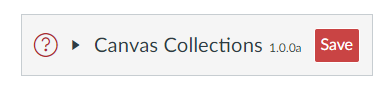

# Component Structure

Canvas Collections is written using the [Svelte framework](https://svelte.dev/). One implication of this is that Collections is implemented as a collection of individual components working together. The following provides an overview of the structure and relationships between those components.

# CanvasCollections.svelte

Ancestor app. Responsible for setting up the Collections box in the top menu (if it should be turned on)

Responsible to obtain data from Canvas (canvas modules and collections config). Initialises the stores used by others.

  

## CollectionsConfiguration

### NewCollections

### FullClaytons

### ExistingCollections

A sequence of `CollectionConfigurations`, one for each of the existing collections

#### CollectionConfiguration

## CanvasCollectionsRepresentation

Populates the representation, consisting of a navBar, any include pages, and the collections' representation

### CollectionsNavigation

### IncludePage

### CollectionRepresentation

#### CollectionOnly

#### AssessmentTable

#### CollectionsTable

#### GriffithCards

## ModuleConfiguration

Implements the configuration interface for each Canvas module. Inserted just after the Canvas module's bar on the module page.

### ModuleGeneralConfiguration

### ModuleDateConfiguration

### ModuleBannerConfiguration

### ModuleMetaDataConfiguration
