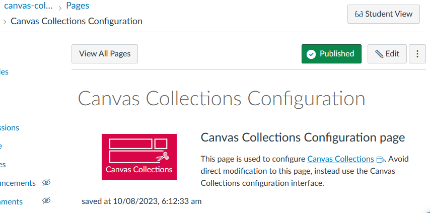

# Canvas Collections configuration page

:under_construction: This page is under construction. It is intended to provide a reference for the JSON configuration file used by Canvas Collections.

## Where

The configuration details of Canvas Collections for a specific course is stored in a Canvas page called ```Canvas Collections Configuration```. It contains a ```div``` element with the class ```cc_json``` which contains a JSON data structure containing the Collections configuration.

<figure markdown>
<figcaption>Example "Canvas Collections Configuration" page</figcaption>

</figure>


## Introducting the Collections configuration JSON

### About JSON

- explain about JSON file format - link to an explanation
- explain about json editors

### Top level attributes

The configuration file defines a number of attributes which control how Canvas Collections behaves. Currently the top level attributes include:

- `VISIBILITY` - Who can see Collection: no-one, students, staff, all
- `DEFAULT_ACTIVE_COLLECTION` - Which collection is shown initially for each user?
- `COLLECTIONS` - What collections are modules grouped into? How are they represented?
- `MODULES` - How are each of the modules to be represented?

The following sections explain the configuration for each of these attributes

-- link to a complete example JSON file that includes the following

## `VISIBILITY`


## `DEFAULT_ACTIVE_COLLECTION`

```json
"DEFAULT_ACTIVE_COLLECTION":"Learning Journey",
```

## `COLLECTIONS`

```json
"COLLECTIONS": {
    "Learning Journey": {
        "representation": "GriffithCards",
        "description" : "",
        "icon" : "far fa-compass"
    },
    "Assessment": {
        "representation": "GriffithCards",
        "description" : "",
    	"icon" : "icon-assignment"
    }
}
```


## `MODULES`

```json
"MODULES": {
    "Welcome and Getting Started": {
        "name": "Welcome and Getting Started",
        "image": "https://www.webwisewording.com/wp-content/uploads/aaron-burden-AvqpdLRjABs-unsplash.jpg",
        "label": "",
        "imageSize": "bg-contain",
        "num": "",
        "description": "<p>Why, how and what you will be learning in this course? How wil you demonstrate your learning? How will you be supported?",
        "collection": "Learning Journey",
        "comingSoon": {
            "date": {
                "week": "4"
            },
            "order": 1
        },
        "date": {
            "label": "Before",
            "week": "1"
        }
    },
    "COM31 FAQs": {
        "image": "https://www.ticliblaxland.com.au/wp-content/uploads/2020/11/UDIN.jpeg", 
        "collection": "Learning Journey",
        "label": "",
        "num:": "",
        "description": "Lorem ipsum dolor sit amet, consectetur adipiscing elit. Vivamus in imperdiet nisi. Etiam non blandit ante. Integer ullamcorper eros nibh. Integer porta, est a porta finibus, turpis nisl semper elit, sed convallis neque ipsum ac ex."
    }
}
```


