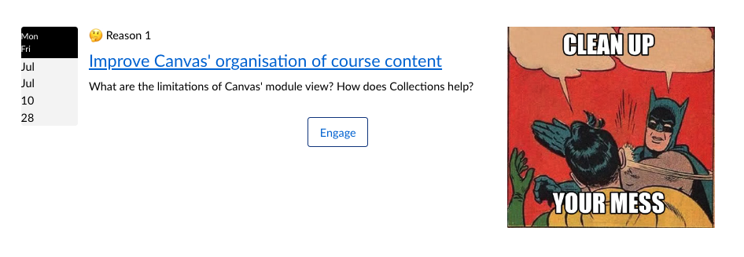
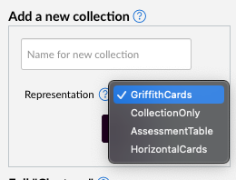
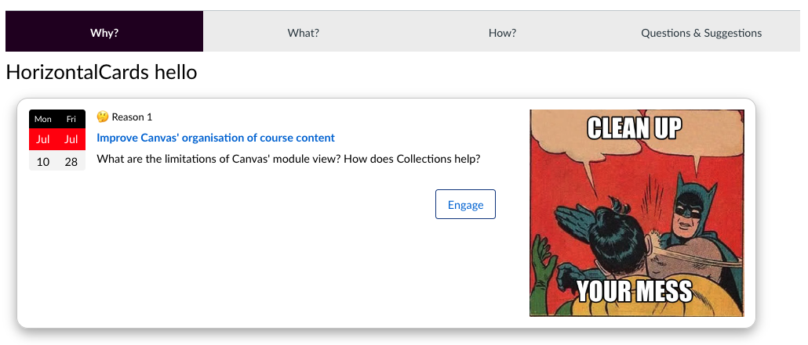
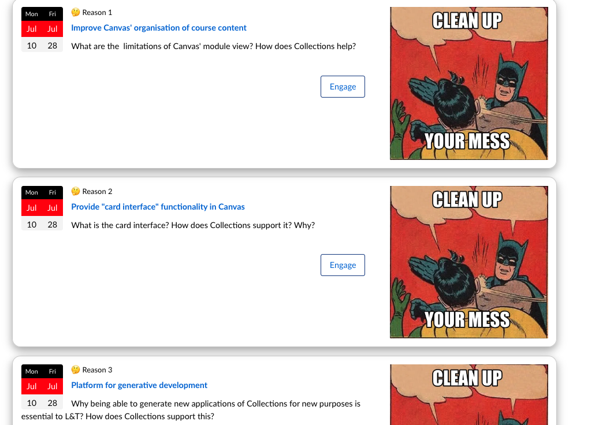

<!--
 Copyright (C) 2023 David Jones
 
 This file is part of Canvas Collections.
 
 Canvas Collections is free software: you can redistribute it and/or modify
 it under the terms of the GNU General Public License as published by
 the Free Software Foundation, either version 3 of the License, or
 (at your option) any later version.
 
 Canvas Collections is distributed in the hope that it will be useful,
 but WITHOUT ANY WARRANTY; without even the implied warranty of
 MERCHANTABILITY or FITNESS FOR A PARTICULAR PURPOSE.  See the
 GNU General Public License for more details.
 
 You should have received a copy of the GNU General Public License
 along with Canvas Collections.  If not, see <http://www.gnu.org/licenses/>.
-->

# Developing a new representation

An example of a suggested process for developing a new representation using the initial development of the _HorizontalCard_ representation as an example

__maybe give overview of the steps, in a table??__


## 1. Design the representation 

### Why? Inspiration?

There are situation where "live" Collections cannot be installed nor can any external CSS. Meaning course design is limited by the Canvas RCE.

The _HorizontalCard_ representation aims to provide a visual (not tabular) representation that can easily used with [Claytons collections](../../conceptual-model/representations/claytons/overview.md). That is, static HTML that can work in the Canvas RCE without requiring any external CSS files. 

Within that constraint the aim is that a single collection's modules can be represented using a vertical sequence of horizontal "cards", each card containing some/all of

- a banner image/iframe
- a header with module name
- the module label/number displayed appropriately
- module dates displayed visually
- the module description

### Design

If you're lucky you are (have access to) a designer. Saving that borrow inspiration from wherever you can find it. i.e. the approach used here.

Here's the [initial set of designs of the _HorizontalCard_ representation](horizontal-cards.html).  Given the aim to be Claytons friendly, the initial designs have focused on that and hence don't take full advantage of some CSS capabilities. The grid format appears somewhat problematic. Hence starting with the first example.


## 2. Test the Claytons in the RCE

Given the RCE only [allows some HTML/CSS](https://community.canvaslms.com/t5/Canvas-Resource-Documents/Canvas-HTML-Editor-Allowlist/ta-p/387066) a manual test is required. As shown below `box-shadow` is not one of the allowed style properties, hence no nice drop shadow when shown in the RCE.

<figure markdown>
<figcaption>Rich Content Editor and no box-shadow</figcaption>

</figure>


## 3. Add the skeleton representation component

With a basic design, time to add the representation. There are three steps.

### 3.1 Decide on a name

In this case, we're going with _HorizontalCards_. 

### 3.2 Create an initial representation file

Each representation is implemented by a single Svelte component stored in the [src/components/Representations folder](https://github.com/djplaner/canvas-collections/tree/main/src/components/Representations) in the Collections source code.

The simplest way to create the initial Svelte component for your representation is to copy and paste the _CollectionsOnly.svelte_ file. _CollectionsOnly_ implements the bare bones minimal for a representation. 

Be sure the filename of the copy matches your representation's name e.g. _HorizontalCards.svelte_

### 3.3. Update the new representation component

You may wish to modify the copyright notice and other minor changes.

There is also a commented out "hello world" heading. Uncommenting this can be a useful early indicator that your new representation is operational.

### 3.3 "Register" the representation

For your new representation to be usable in Collections, it needs to be registered. This is done by editing the [src/stores.ts file](https://github.com/djplaner/canvas-collections/blob/main/src/stores.ts) in the Collections repository. 

There are two changes to be made:

1. Import the newly created representation svelte file

    ```javascript
    import HorizontalCards from "./components/Representations/HorizontalCards.svelte
    ```

2. Add an entry to the `representationStore` store

    ```javascript
    "HorizontalCards": HorizontalCards
    ```

### 3.4 Test if it's working

If you make the above changes and re-build your local version of Collections you should then be able to add a new 

<figure markdown>
<figcaption>New representation (HorizontalCards) ready for use</figcaption>

</figure>

## 4. Refine it

And now the real work begins. Adding in the HTML from your design and replace hard-coded values with Svelte statements that Collections can use.

### 4.1 Add your existing HTML

For _HorizontalCards_ I copy and pasted the appropriate code from the [design options](horizontal-cards.html) into the new Svelte component just under the hello world. To test it, I modified one of the collections from my sample course to use the new representation. 

Tweak the HTML correctly and the following hard-coded HTML gets presented.

<figure markdown>
<figcaption>Early days for HorizontalCards</figcaption>

</figure>

### 4.2 Add the module loop

The remaining works involves modifying the Svelte component for your representation. Replacing hard-coded values with variables that make the representation work with any collection and its modules.

First step is adding a loop around the single module representation. This is done using the Svelte ```each``` command and the array ```modules``` already created. ```modules``` is an array of objects. Each representing one of the modules for the current collection and providing access to all the available information about the module.

For example, the following code generates three versions of the above figure. One for each of the three modules in the collection I'm using for testing.

```html
{#each modules as theModule}
<div>
</div>
{/each}
```

### 4.3 Replace the hard-coded values

The next step is to replace the hard-coded values (e.g. for dates, module title etc) with information about the specific modules. There are two broad ways of doing this, using:

1. variables; or,
2. other Svelte components.

Looking at other representation components (e.g. [GriffithCards](https://github.com/djplaner/canvas-collections/blob/main/src/components/Representations/GriffithCards.svelte)) may help.

#### Variables

Collections maintains two data structures that provide access to Canvas and Collections information about each module.

1. ```theModule``` variable is ["Collections Canvas module" object](../data-structures.md#collections-canvas-module-object) and provides some basic information from Canvas about a specific module. In particular, the module id.
2. The module id can be used to access the [```$collectionStore```](../data-structures.md#collectionsstore) and the information Collections stores about each module. 

    The ["Collections module object" section](../data-structures.md#collections-module-object) of the [data structures page](../data-structures.md) provides more detail about the variables that are available.

The following table provides a mapping between the hard-coded values in the existing design of HorizontalCards and how to relevant Collections variables (or functions). Examine the _GriffithCards_ (or other) representations to see examples.

The task now is to replace the hard-coded values in the representation component with the appropriate Svelte variable statements. Once done, we get the figure below.

| Value required | Existing value | Svelte variable |
| --- | --- | --- |
| Label and number | 🤔 Reason 1 | ```$collectionsStore["MODULES"][theModule.id].label``` and ```$collectionsStore["MODULES"][theModuleId].actualNum]``` |
| Module name | Improve Canvas' organisation of course content | ```theModule.name``` |
| Module name (de-labeled) | Improve Canvas' organisation of course content | ```deLabelModuleName( $collectionsStore["MODULES"][theModule.id])}``` |
| Module description | What are the limitations of Canvas' module view? How does Collections help? | ```$collectionsStore["MODULES"][theModule.id].description```|
| Link to Module | http://canvas.docker/courses/1/modules#module_1 | the ```getModuleUrl`` function |

A "de-labeled" module name will not include the module's label and number. Useful for improving the visual display.

<figure markdown>
<figcaption>Some variables for each module working</figcaption>

</figure>

#### Other Svelte components and complexities

Some of the features used by representations are more complex than simple variables. The functions introduced above (```getModuleUrl``` and ```deLabelModuleName```) are simple examples. More complex examples include: use of other Svelte components; or more complex Svelte statements in the representation.

The following table summarises the additional complexities required by `HorizontalCards` and one by an existing Collections feature ([FYI modules](../../conceptual-model/objects/general.md#fyi-objects)). Due to its design it borrows heavily from the _GriffithCards_ representation. With a different representation you may be creating your own components.

| Value required | Existing Value | Additional complexity |
| --- | --- | --- |
| Module date | A dual date from July 10 to 28 | [`DateWidget` component](https://github.com/djplaner/canvas-collections/blob/main/src/components/Representations/GriffithCards/DateWidget.svelte)|
| Banner (image) | Batman/Robin meme image | A group of three related [banner components](https://github.com/djplaner/canvas-collections/tree/main/src/components/Representations/GriffithCards) |
| Engage button | Button visible with `Engage` | More complex conditional Svelte statements to show (or not) the button as configured |
| [FYI objects](../../conceptual-model/objects/general.md#fyi-objects) | n/a | If a module is an FYI object, display a message and don't link to it | 

### 4.4 The more difficult work

## 5. Add the Claytons version


## 6. Test it