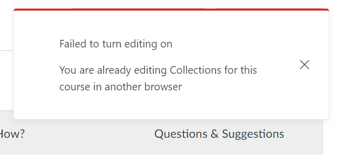
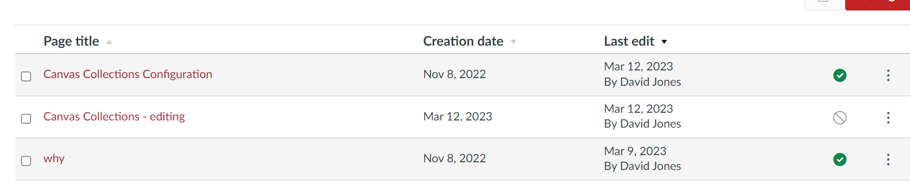

// Copyright (C) 2023 David Jones
// 
// This file is part of Canvas Collections.
// 
// Canvas Collections is free software: you can redistribute it and/or modify
// it under the terms of the GNU General Public License as published by
// the Free Software Foundation, either version 3 of the License, or
// (at your option) any later version.
// 
// Canvas Collections is distributed in the hope that it will be useful,
// but WITHOUT ANY WARRANTY; without even the implied warranty of
// MERCHANTABILITY or FITNESS FOR A PARTICULAR PURPOSE.  See the
// GNU General Public License for more details.
// 
// You should have received a copy of the GNU General Public License
// along with Canvas Collections.  If not, see <http://www.gnu.org/licenses/>.

# Failed to turn editing on

## Symptom

When you try to turn editing on, you see something like the following image. The source of the error may vary, but the overall result is you can't modify Collections' configuration.

!!! note "By itself this doesn't indicate a problem - see below for more information"

<figure markdown>
<figcaption>The "Failed to turn editing on" error</figcaption>

</figure>

## Explanation

As summarised on [the edit life cycle page](../../reference/lifecycle/editing/lifecycle.md) only one person in one browser can edit a Canvas course's Collections configuration.

The error above indicates that someone else (perhaps you in another browser window) are currently editing this course's Collections configuration.

Normally, if that person stops making changes to the course's Collections configuration their permission to edit will be removed. Allowing other people to edit.

## What about when it goes wrong?

There may be circumstances where this process does not work or you need to make changes as soon as possible. There are at least two ways to address this:

1. Talk with your teaching team and ask them to stop editing.
2. Force the removal of the editing lock.

### Talk with your teaching team

The only people who can edit a Canvas course's Collections configuration are those with teacher/designer roles for the course. You may well know these people and are able to communicate with them and ask them to stop editing.

### Force the removal of the editing lock

The Collections editing lock is implemented using an unpublished Canvas page titled _Canvas Collections - editing_. If you go to the course's pages view and sort by "last edit" you will likely see something like the following image. Where the Collections configuration page and its editing lock page are the most recently edited pages.

!!! tip "Remove the Collections editing lock page to remove the editing lock"

<figure markdown>
<figcaption>Examining the pages view for the Collections editing lock</figcaption>

</figure>
