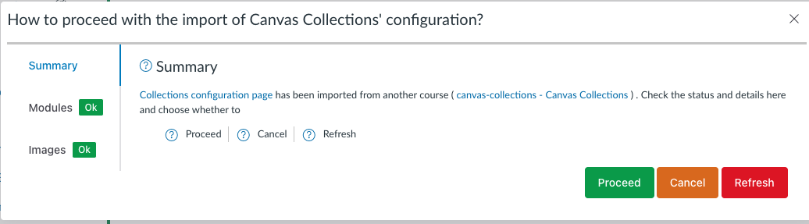

<!--
 Copyright (C) 2023 David Jones
 
 This file is part of Canvas Collections.
 
 Canvas Collections is free software: you can redistribute it and/or modify
 it under the terms of the GNU General Public License as published by
 the Free Software Foundation, either version 3 of the License, or
 (at your option) any later version.
 
 Canvas Collections is distributed in the hope that it will be useful,
 but WITHOUT ANY WARRANTY; without even the implied warranty of
 MERCHANTABILITY or FITNESS FOR A PARTICULAR PURPOSE.  See the
 GNU General Public License for more details.
 
 You should have received a copy of the GNU General Public License
 along with Canvas Collections.  If not, see <http://www.gnu.org/licenses/>.
-->

Collections' configuration information stores the _course identifier_ for its original course. When Collections is run it checks that the course id in its configuration matches the current course id.  If there isn't a match, Collections will launch its course copy/import process and

1. Attempt to match the module information in its configuration with the module information in the new course.
2. Check the image links in its configuration are from the new course.
4. Display a dialog reporting what it found and asking whether you wish to 
   	1. Proceed - Collections will update the configuration as reported.
   	2. Cancel - Prevent Collections from doing anything and leave the Collections cofiguration as is to provide you an opportunity to perform some manual change.
   	3. Refresh - Collections will remove all the previous Collections configuration information and create a fresh and empty Collections configuration ready for you to start afresh.

<figure markdown>
<figcaption>Example Collections copy/import dialog</figcaption>

</figure>

## What does it look like?

The Collections copy/import dialog consists of three tabs that provide you with information about the status of the copy/import, ready for your decision. The table below provides a description of the three tabs and the animated image below demonstrates one course copy process.

| Tab | Description |
| --- | ----------- |
| [Summary](import.md#summary) | Provide an overview and explanation and offer the three choices of: proceed; cancel; and, refresh |
| [Modules](import.md#modules) | Shows the results of Collections' attempts to match the _imported_ modules (from Collections configuration) with the _current_ modules in the desination course. Three possibilities are shown <ol> <li> Imported modules that matched current modules</li> <li> Imported modules that were not match </li> <li> Current modules that were not matched </li> </ol> |
| [Images](import.md#image) | A list of Collections' card images that are from another course's files area |

<figure markdown>
<figcaption>Example Collections copy/import process</figcaption>
<sl-animated-image src="../images/animatedImport.gif" alt="Example Collections copy/import process">
</figure>

