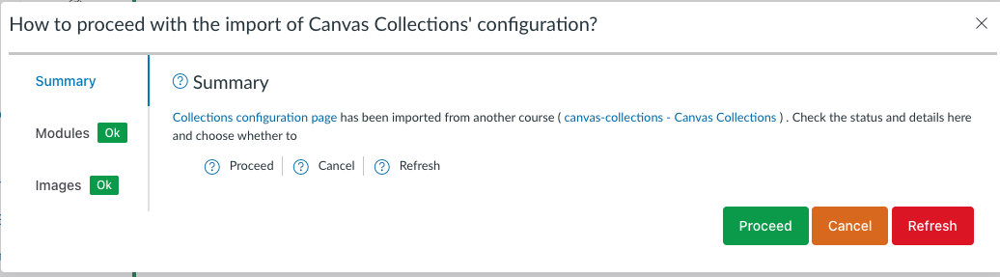

<!--
 Copyright (C) 2023 David Jones
 
 This file is part of Canvas Collections.
 
 Canvas Collections is free software: you can redistribute it and/or modify
 it under the terms of the GNU General Public License as published by
 the Free Software Foundation, either version 3 of the License, or
 (at your option) any later version.
 
 Canvas Collections is distributed in the hope that it will be useful,
 but WITHOUT ANY WARRANTY; without even the implied warranty of
 MERCHANTABILITY or FITNESS FOR A PARTICULAR PURPOSE.  See the
 GNU General Public License for more details.
 
 You should have received a copy of the GNU General Public License
 along with Canvas Collections.  If not, see <http://www.gnu.org/licenses/>.
-->

[Importing Collections](overview.md) typically happens after a course copy. Collections detects a Collections configuration file from another course. In response, Collections will display the "import" popup. The popup has three main sections explained below.

## Summary

The _summary_ tab of the import dialog provides a summary of the situation. It offers you a choice of how to proceed with the import.

### How to proceed?

#### Proceed

If you choose _Proceed_, Collections will attempt to update the configuration as reported in the other tabs. Currently, the main change Collections will make is to update the module identifiers in the Collections configuration. 

Initially this identifiers will be for the modules in the original course. The course copy process will have created copies of these modules in the new course. These new modules will have different identifiers. Collections will update to the new identifiers.

#### Cancel

If you choose _Cancel_, Collections will **not** make any changes to the Collections configuration. 

This allows you to make any necessary manual changes to the course of Collections configuration before you import Collections again at a later time.

#### Refresh

If you choose _Refresh_, Collections will remove all the previous Collections configuration information and create a fresh and empty Collections configuration. It cleans the slate reday for you to start configuring Collections again (if you decide).

<figure markdown>
<figcaption>Summary tab of Collections import dialog</figcaption>

</figure>

## Modules

The _modules_ tab summarises the outcomes of the checks on module identifiers Collections performed. These checks compared the names and identifiers of the modules in the Collections configuration file with the names and identifiers of the modules in the current course. It looks for three cases

1. Imported modules matched;

    The number of modules in the Collections configuration file that have names matching modules in the current course. 

2. Imported modules not matched; and,

    Any modules from the Collections configuration file with names not found in the current course. Perhaps indicating modules that were not copied from the original course.

3. Current modules not matched.

    Any modules from the current course with names not matching any modules in the Collections configuration file. Suggesting modules that were not in the original course and thus not in the Collections configuration file.

The modules tab in the following figure indicates a _clean_ course copy. All modules in the Collections configuration file were matched, and there are no other modules in the current course not in the Collections configuration file.

Suggesting that Collections will be able to successfully import the Collections configuration file.

<figure markdown>
<figcaption>Modules tab of Collections import dialog</figcaption>

</figure>

## Images

The _images_ tab performs checks if any images used in Collections are hosted in a Canvas course site files area. In particular, it checks to see if there are any such images that are not based in the current course.

Since Canvas automatically updates links to images (and other resources) within a course site's files area, there should normally not be any problem. As shown in the following image.

<figure markdown>
<figcaption>Images tab of Collections import dialog</figcaption>

</figure>
