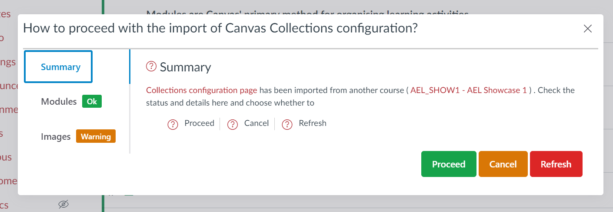

# Course Copy - Canvas Collections

Canvas provides a [course copy process](https://community.canvaslms.com/t5/Instructor-Guide/How-do-I-copy-content-from-another-Canvas-course-using-the/ta-p/1012). A method for reusing content from one course to another. Canvas Collections configuration information can be safely copied from one course to another. The following explains.

!!! warning "Claytons Collections pages may need to be re-generated after a course copy"

	Collections additional course copy process only works with [_live_ Collections](../../../how-tos/navigating/navigating-live-collections.md).

	[Claytons Collections](../../../how-tos/navigating/navigating-claytons-collections.md) are static HTML pages generated by _live_ Collections. They are copied as normal pages. Some of the information may be out of date.

	A prime example will be dates.

!!! tip "A _clean_ copy will be a _good_ copy"

	A _clean_ copy is where the destination course is "clean".
	
	i.e. it only contains information from the existing course. Nothing has already been added, modified, or removed.
	
	This makes it easy for Collections to update its configuration correctly.

	**A _clean_ copy will be a _good_ copy.**

=== "What needs to happen after a course copy?"

	Collections' configuration information may contain information that needs to be updated to work with the new course. Collections will check and, in some cases, attempt to update this information, including:

	- Module identifiers (ids) - the modules in the new course will have different module ids.
	- Course image links - it is common to use images from a course's files area in Collections. A normal course copy process should result in these being modified. But Collections will check.

=== "How does it work?"

	Collections' configuration information stores the _course identifier_ for its original course. When Collections is run it checks that the course id in its configuration matches the current course id.  If there isn't a match, Collections will launch its course copy/import process and

	1. Attempt to match the module information in its configuration with the module information in the new course.
	2. Check the image links in its configuration are from the new course.
	4. Display a dialog reporting what it found and asking whether you wish to 
      	1. Proceed - Collections will update the configuration as reported.
      	2. Cancel - Prevent Collections from doing anything and leave the Collections cofiguration as is to provide you an opportunity to perform some manual change.
      	3. Refresh - Collections will remove all the previous Collections configuration information and create a fresh and empty Collections configuration ready for you to start afresh.

	<figure markdown>
	<figcaption>Example Collections copy/import dialog</figcaption>
	
	</figure>

=== "What does it look like?"

	The Collections copy/import dialog consists of three tabs that provide you with information about the status of the copy/import, ready for your decision. The table below provides a description of the three tabs and the animated image below demonstrates one course copy process.

	| Tab | Description |
	| --- | ----------- |
	| Summary | Provide an overview and explanation and offer the three choices of: proceed; cancel; and, refresh |
	| Modules | Shows the results of Collections' attempts to match the _imported_ modules (from Collections configuration) with the _current_ modules in the desination course. Three possibilities are shown <ol> <li> Imported modules that matched current modules</li> <li> Imported modules that were not match </li> <li> Current modules that were not matched </li> </ol> |
	| Images | A list of Collections' card images that are from another course's files area |

	<figure markdown>
	<figcaption>Example Collections copy/import process</figcaption>
	<sl-animated-image src="../images/animatedImport.gif" alt="Example Collections copy/import process">
	</figure>

<link rel="stylesheet" href="https://cdn.jsdelivr.net/npm/@shoelace-style/shoelace@2.0.0/dist/themes/light.css" />

