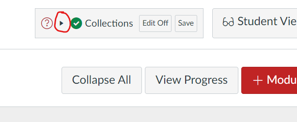

# Editing Collections

## Pre-requisites

Before you can edit Collections, you must

1. Be able to see [the _Student View_ button](https://community.canvaslms.com/t5/Instructor-Guide/How-do-I-view-a-course-as-a-test-student-using-Student-View/ta-p/1122) on the course modules page.
2. Successfully turn _edit on_.

!!! note "Only one person can edit at a time"

	For each course, only one person is able to edit the Collections configuration information at a time.

## The edit life cycle

=== "Try to turn _edit on_"

	Initially, when viewing the course Modules page you will be in view mode. In the top right hand corner, you should be able to see both the Collections element (circled in red in the figure below) and next to it the _Student View_ button.

	To edit Collections, you click the _Edit On_ button to turn Collections editing on.

	<figure markdown>
	<figcaption>Staff view mode</figcaption>
	  
	</figure>

=== "Someone else is editing"

	After clicking the _Edit On_ button you will only be able to edit if no-one else (including you in another browser) are editing the same course's Collections configuration.

	If someone else is editing, you will see an alert (figure below) and will not be able to edit. As shown below, the alert will tell if it is you or someone else who is editing.

	<figure markdown>
	<figcaption>Someone else (you) is editing</figcaption>
	
	</figure>

=== "You are editing"

	!!! note "Collections will update first"

		The first step in turning _edit on_ is to update the Collections configuration information to ensure you are editing the latest version. Meaning you may see a change in your Collections view as editing is turned on

	If no-one else is editing, you will be able to edit. The changes you see will include:

	1. the _Edit On_ button will become the _Edit Off_ button
	2. The Collections element (the first figure below) will include additional "edit" features (e.g. the _Save_ button and the "arrow" icon to configure the collections)
	3. Each Canvas module will have a Collections' module configuration element (the second figure below)

	<figure markdown>
	<figcaption>You are editing</figcaption>
	
	</figure>

	<figure markdown>
	<figcaption>A Canvas module with a collapsed Collections' module configuration element</figcaption> 
	  
	</figure>

=== "Turn _edit off_"

	Clicking on the _edit off_ button will turn editing off. Returning the Collections element to the view mode and removing the Collections' module configuration elements.

=== "Automatic _edit off_"

	Collections will automatically turn _edit off_ if you

	1. Leave the Modules page for which editing was turned on.
	2. You have not made any edits to Collections for a given time period (the default is 2 minutes).
