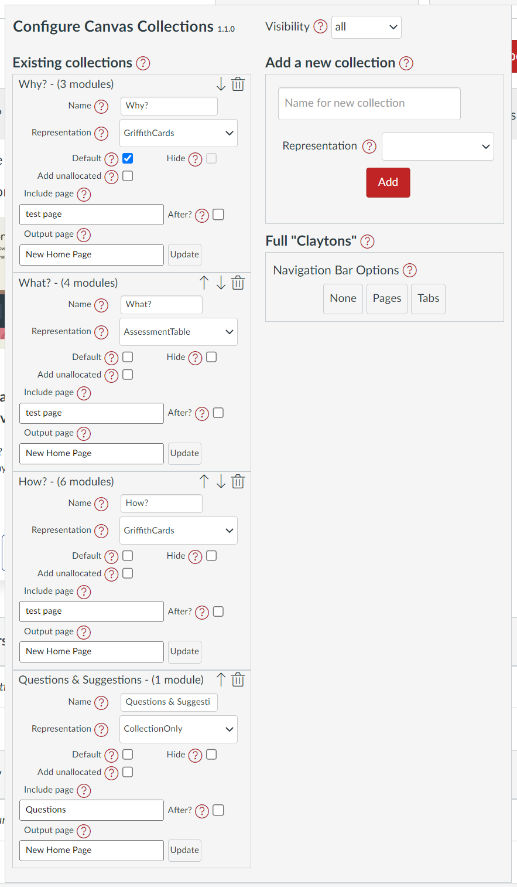
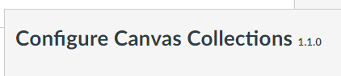
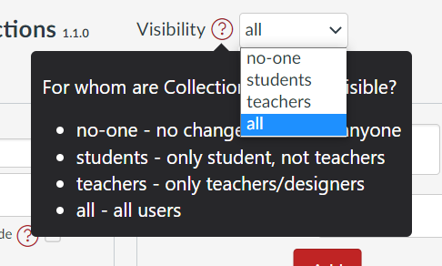
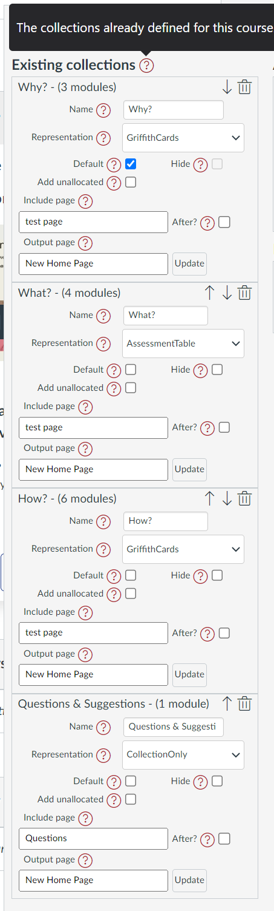
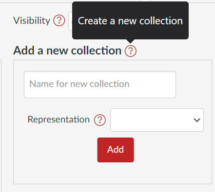
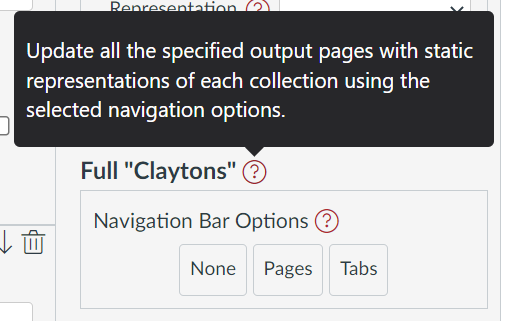

# Configure Collections

With _Edit on_ you can open the _Collections element_ to configure both

- Collections; and,

	Change the visibility of Collections or use the Claytons functionality.

- collections.

	Add a new collection, editing an existing collection, or update an _output_ page for one collection.

!!! note "The difference between _C_ollections and _c_ollections"

	**C**ollections (upper case C) refers to Canvas Collections. The entire tool and how it is applied to your course.

	**c**ollections (lower case c) are the individual groupings of modules you create and manage using Collections.

=== "Collections element"

	The _Collections element_ is the main interface for configuring Collections (see image below). It contains a number of different sections that are described in more detail in the other tabs. By default, the Collections element is hidden. It is only visible with _Edit on_.

	<figure markdown>
	<figcaption>Canvas Collections element</figcaption>
	
	</figure>

=== "Title and version number"

	In the top left hand corner of the Collections element is the title _Configure Canvas Collections_ and the version number of the Collections you are currently using.

	Compare the version with [the latest version page](../../../about/latest-version.md)

	<figure markdown>
	<figcaption>Canvas Collections title and version number</figcaption>
	
	</figure>

=== "Visibility"

	The "visibility" menu allows you to change who can see live collections. There are four options.

	| Visibility option | Description |
	| --- | --- |
	| no-one | No-one can see live collections. |
	| students | Only students can see live collections. |
	| teachers | Only teachers/designers can see live collections. |
	| all | Everyone can see live collections. |

	!!! info "See [the _live_ visibility page](../visibility/live.md) for more."

	<figure markdown>
	<figcaption>Collections' visibility menu</figcaption>
	
	</figure>

=== "Existing collections"

	The "existing collections" section contains one section for each of the collections currently created for this course. Each collection's section provides a number of configuration options and functions to perform.

	!!! info "See [the _Existing Collections_ page](../../conceptual-model/collections/existing-collections.md) for more."

	<figure markdown>
	<figcaption>A list of existing collections</figcaption>
	
	</figure>

=== "Add a new collection"

	To add a new collection you provide the collection's name and choose a representation.

	!!! info "See [the _Add a new collection_ page](../../conceptual-model/collections/add-a-new-collection.md) for more."

	<figure markdown>
	<figcaption>Add a new collection</figcaption>
	
	</figure>

=== "Full 'Claytons'"

	The "Full Claytons" option provides the method to update Canvas pages with the representations of selected collections.

	!!! info "See [the _Full Claytons_ page](../../conceptual-model/collections/full-claytons.md) for more."

	<figure markdown>
	<figcaption>Full Claytons</figcaption>
	
	</figure>
