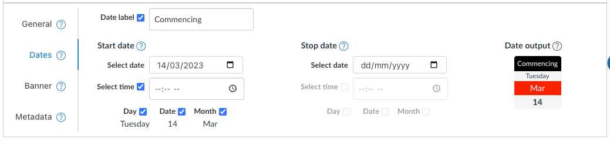

# Configure Modules

With _Edit on_ each Canvas module should have a Collections' _Module configuration_ element added just under the module's title. Use this to configure how the individual module is represented and used by Collections.

Each _Module configuration_ element consists of the same four tabs.

!!! warning "Collections may not recognise recent changes in Canvas modules"

	Collections doesn't immediately recognise changes made to Canvas modules. For example, if you've added a new module or changed the title or publish status of an existing module. 

	Collections checks for these changes every 20 seconds or so. Until then, it will not recognise the changes.

	If you reload the modules page, Collections will recognise the changes. 

!!! note "See [the _Objects (aka Activities)_ page](../../conceptual-model/objects/overview.md) for more on configuring modules into objects."

=== "Module configuration element"

	The _Module configuration element_ provides a number of common sections used to configure each module for Collections.

	| Section | Description |
	| --- | --- |
	| Header | The header or title bar contains the title of the module. Clicking on the module header will open/collapse the module configuration element. If a module is not allocated to a collection it will include a _No Collection Allocated_ badge |
	| Body | The body of the config provides the four tabs used to configure the module. |
	| Tabs | Allows you to navigate to each of the four tabs. |
	| Tab panels | Provides the configuration interface for each individual tab. |

	<figure markdown>
	<figcaption>Module configuration element</figcaption>
	
	</figure>

=== "General tab"

	The _General tab_ is the default tab and provides the main configuration options for each module, including allocating a module to a collection and adding a description.

	!!! info "See [the _General tab_ page](../../conceptual-model/objects/general.md) for more."

	<figure markdown>
	<figcaption>The general module configuration tab</figcaption>
	
	</figure>

=== "Dates tab"

	Each module can have a date period associated with it. The dates tab provides a way to specify this date period.

	!!! info "See [the _Dates tab_ page](../../conceptual-model/objects/dates.md) for more."

	<figure markdown>
	<figcaption>The dates module configuration tab</figcaption>
	
	</figure>

=== "Banner tab"

	Certain representations support the notion of a banner using an image, colour, or iframe. The banner tab provides a way to specify this banner.

	!!! info "See [the _Banner tab_ page](../../conceptual-model/objects/banner.md) for more."

	<figure markdown>
	<figcaption>The banner module configuration tab</figcaption>
	
	</figure>

=== "Metadata tab"

	Certain representations make use of additional data about the module. For example the _AssessmentTable_ representation uses _learning outcomes_. The metadata tab provides a way to provide a list of additional metadata (name and value).

	!!! info "See [the _Metadata tab_ page](../../conceptual-model/objects/metadata.md) for more."

	<figure markdown>
	<figcaption>The metadata Module configuration tab</figcaption>
	
	</figure>