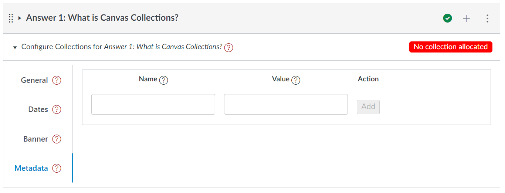

# Module Configuration

=== "General"

        The _General_ tab provides standard module configuration options. These include specifying the collection a module belongs to, its description, label etc.

        <figure>
        <figcaption>The general tab of the module configuration area</figcaption>
          
        </figure>

=== "Dates"

    Use the _Dates_ tab to associate a date or date range with a module. e.g. specifying availability, a due date, or when an activity occurs. Dates are specified based on weeks of an academic calendar.

    <figure>
    <figcaption>The dates tab of the module configuration area</figcaption>
      
    </figure>

=== "Banner"

    A module can be configured - using the _Banner_ tab - to have one of three types of banner (typically used by the _Cards_ representation), including:

    1. image - any image with a URL can be used.
    2. iframe - a standard embed code (e.g. a YouTube video).
    3. colour - a colour can be specified.

    <figure markdown>
    <figcaption>The banner tab of the module configuration area</figcaption>
      
    </figure>

=== "Metadata"

    Each of the other tabs are used to configure metadata that is designed for some pre-defined purpose. The _Metadata_ tab is used to manage generic metadata. Metadata that you may simply wish to store, or that may be used by a custom representation.

    <figure markdown>
    <figcaption>The metadata tab of the module configuration area</figcaption>
      
    </figure>
