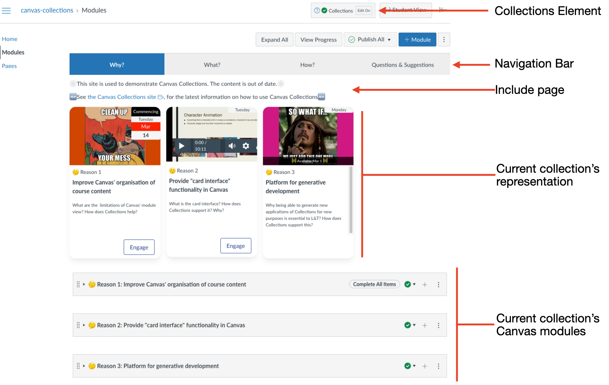

# Navigating Canvas Collections (_live_)

A teacher/designer can use the live Canvas Collections navigation interface to perform specific navigation tasks (explained below)

<figure markdown>
<figcaption>Labelled Collections teacher/designer navigation interface</figcaption>

</figure>

===	"Switch between collections"

	Clicking on the collection name in the _Navigation bar_ will switch to a collection.

	<figure markdown>
	<figcaption>Switching between collections</figcaption>
	<sl-animated-image alt="Switching between collections" src="../images/animatedSwitching.gif" />
	</figure>

=== "Return to the last collection you were looking at"

	Collections will remember the last collection you were looking at for a course. The next time you return the _modules_ page for that course, Collections will show you the last collection you were looking at.

	<figure markdown>
	<figcaption>Returning to the last collection you were looking at</figcaption>
	<sl-animated-image alt="Returning to the last collection you were looking at" src="../images/animatedReturn.gif" />
	</figure>

=== "Navigate directly to a collection"

	Each collection has its unique URL. You can use that URL to navigate directly to a collection.

	<figure markdown>
	<figcaption>Direct navigation to a collection</figcaption>
	<sl-animated-image alt="Direct navigation to a collection" src="../images/animatedDirectNavigation.gif" />
	</figure>

=== "Navigate to a module"

	When a collection is using a representation, most representations will provide a method to link directly to a specific module within the display of current collection's Canvas modules. 

	<figure markdown>
	<figcaption>Direct navigation to a module</figcaption>
	<sl-animated-image alt="Direct navigation to a module" src="../images/animatedDirectModuleNavigation.gif" />
	</figure>

=== "Scroll to a module"

	Since all the modules allocated to the current collection are visible underneath the current collection's representation, you can simply scroll down the page to find any module allocated to the collection.

	<figure markdown>
	<figcaption>Scrolling to a module</figcaption>
	<sl-animated-image alt="Scrolling to a module" src="../images/animatedScrolling.gif" />
	</figure>

<link rel="stylesheet" href="https://cdn.jsdelivr.net/npm/@shoelace-style/shoelace@2.0.0/dist/themes/light.css" />
