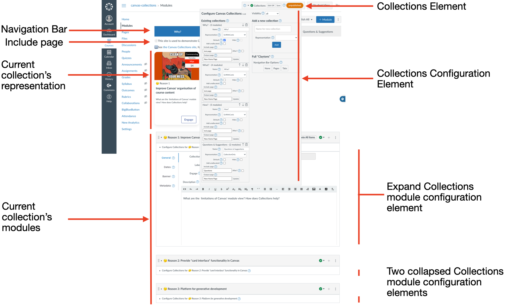

# Staff view of Canvas Collections

The teacher/designer experience of Collections depends on the type of Collections (i.e. _Live_ or _Claytons_) and the mode when using _live_ Collections (i.e. _navigate_ or _edit_).

=== "_Claytons_ Collections" 

	Claytons Collections is static HTML representation of Collections saved to a Canvas page. The teacher/designer experience is the same as any other page. They can view, modify, and delete it. 
	
	The image and table below provide an example and description of the Claytons Collections view for teachers/designers. The elements listed here are also visible in _Live_ Collections and are explained in more detail the "_Live_ Collections - _navigate_ mode" tab. In Claytons, however, the elements are implemented using the limited HTML and CSS allowed by the Canvas Rich Content Editor (RCE).
	
	!!! info "See [the _Navigating Claytons Collections_ page](../../../how-tos/navigating/navigating-claytons-collections.md) for more"

	| Interface Element | Description |
	| ----------------- | ----------- |
	| Navigation Bar | Shows a list of all collections and allows navigation back and forth between collections. |
	| Include page (optional) | 
Each collection and have a single <em>Include page</em>. i.e. a Canvas page, the content of which will be inserted before or after the <em>Current collection's representation</em>.

<strong>Note: Only the current collection's include page is shown.
 |
	| Current collection's representation | 
Each collection chooses from one of the [available representations](../../conceptual-model/representations/overview/). Representations are designed to provide a bespoke visualisation of the Canvas modules allocated to the current collection.
|

	<figure markdown>
	<figcaption></figcaption>
	
	</figure>

=== "_Live_ Collections - _navigate_ mode"

	Largely the same as the student experience navigating _live_ Collections, but with slightly more permissions. The image is one representation of the teacher/designer experience of navigating _live_ Collections. The labels are used in the table to describe the interface elements in more detail.
	
	!!! info "For more on navigating Collections"

		[_Navigating_ reference](navigating.md) for details.

		[_Navigating Live Collections_ how-to](../../../how-tos/navigating/navigating-live-collections.md) for examples.

	| Interface Element | Description |
	| ----------------- | ----------- |
	| Collections Element | 
Visible only to teachers/designers this element provides:
<ol> <li> status information about the configuration of Collections for this course; and, </li><li> the ability to modify that configuration. </li> </ol>
<strong>Note:</strong> the _Edit On_ button in the Collections element. Indicating that this is navigation mode.
|
	| Navigation Bar | Shows a list of all collections and allows navigation back and forth between collections. |
	| Include page (optional) | 
Each collection and have a single <em>Include page</em>. i.e. a Canvas page, the content of which will be inserted before or after the <em>Current collection's representation</em>.

<strong>Note: Only the current collection's include page is shown.
 | 
	| Current collection's representation | 
Each collection chooses from one of the [available representations](../../conceptual-model/representations/overview/). Representations are designed to provide a bespoke visualisation of the Canvas modules allocated to the current collection.
|
	| Current collections' modules | The normal list of Canvas modules modified to just show those modules allocated to the current collection. | 

	<figure markdown>
	<figcaption>Labelled Collections teacher/designer navigation interface</figcaption>
	
	</figure>

	!!! note "Click on the image to enlarge it"

=== "_Live_ Collections - _edit_ mode"

	Teachers/designers are able to turn _Edit on_ to enter _edit_ mode and thus configure Collections. In _edit_ mode, the Collections interface is largely the same as the _navigating_ interface. The two differences being
	
	1. The _Collections element_ can be opened to [start configuring collections](editing/collections.md).
	2. The _Module config(uration)_ elements can be opened to [start configuring modules](editing/modules.md).

	!!! note "See the table on the '_Live_ Collections - _navigate_ mode' tab for a description of the common interface elements"
	
	!!! info "For more on editing Collections"
	
		[_Editing_ reference](editing.md) for details.

		[_Editing Live Collections_ how-to](../../../how-tos/editing/editing-live-collections.md) for examples.

	| Interface Element | Description |
	| ----------------- | ----------- |
	| (open) Collections element | 
Once open, the Collections element displays a list of all existing collections and provides functionality to add a new collection and modify/remove existing collections.

It's the primary element for [configuring collections](editing/collections/)
 |
	| Module Config(uration) |
Each module allocated to the current collection will have its own module configuration element. When open, this element provides the ability to add and modify Collections metadata about a module.

It's the primary element for [configuring modules](editing/modules/) 	|

	<figure markdown>
	<figcaption>Labelled Collections teacher/designer edit interface</figcaption>
	
	</figure>

	!!! note "Click on the image to enlarge it"